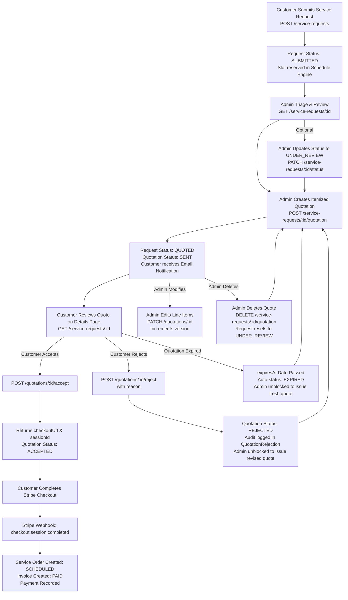
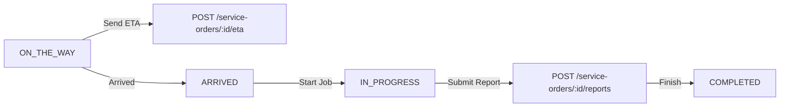

# 🚀 Frontend API Integration Guide (Phase-by-Phase)

Welcome to the **Elite Central Vacuum** API Integration Guide. This document provides a complete, step-by-step roadmap for frontend engineers (React, Next.js, Vue, Mobile) to integrate every feature domain of the backend.

---

## 📑 Table of Contents

- [Phase 0: Global Architecture & Client Setup](#phase-0-global-architecture--client-setup)
- [Phase 1: Authentication & User Accounts](#phase-1-authentication--user-accounts)
- [Phase 2: Product Categories & Taxonomy](#phase-2-product-categories--taxonomy)
- [Phase 3: Products Catalog, Filtering & Media](#phase-3-products-catalog-filtering--media)
- [Phase 4: Shopping Cart Management](#phase-4-shopping-cart-management)
- [Phase 5: Customer Delivery Addresses & CRM Management](#phase-5-customer-delivery-addresses--crm-management)
- [Phase 6: E-Commerce Orders, Checkout, Returns & Invoices](#phase-6-e-commerce-orders-checkout-returns--invoices)
- [Phase 7: Central Vacuum Services Catalog & Scheduling](#phase-7-central-vacuum-services-catalog--scheduling)
- [Phase 8: Service Intake Requests & Attachments](#phase-8-service-intake-requests--attachments)
- [Phase 9: Quotations & Customer Approval](#phase-9-quotations--customer-approval)
- [Phase 10: Service Orders & Technician Dispatch](#phase-10-service-orders--technician-dispatch)
- [Phase 11: Real-Time WebSocket & In-App Notifications](#phase-11-real-time-websocket--in-app-notifications)
- [Phase 12: Invoicing, Payments & Refunds](#phase-12-invoicing-payments--refunds)
- [Phase 13: Customer Reviews & Ratings](#phase-13-customer-reviews--ratings)
- [Phase 14: System Settings, FAQs & Legal Policies](#phase-14-system-settings-faqs--legal-policies)
- [Phase 15: CSV Data Export & Reporting](#phase-15-csv-data-export--reporting)
- [Phase 16: Live Real-Time Support Chat & WebSockets](#phase-16-live-real-time-support-chat--websockets)
- [Phase 17: Field Technician Mobile Portal & Admin Management](#phase-17-field-technician-mobile-portal--admin-management)

---

## Phase 0: Global Architecture & Client Setup

### Base URLs & Environment

| Environment     | REST API Base URL            | WebSocket Gateway URL                    | Swagger Docs                      |
| :-------------- | :--------------------------- | :--------------------------------------- | :-------------------------------- |
| **Development** | `http://localhost:3000`      | `ws://localhost:3000/notifications`      | `http://localhost:3000/docs`      |
| **Production**  | `https://api.yourdomain.com` | `wss://api.yourdomain.com/notifications` | `https://api.yourdomain.com/docs` |

### Standard Request Headers

```http
Content-Type: application/json
Accept: application/json
Authorization: Bearer <accessToken>
```

### Cookie Strategy (`credentials: 'include'`)

The backend uses a hybrid token strategy:

1. **Access Token (`accessToken`)**: Short-lived (15m–1h) returned in the response body. Store in memory (or secure client state).
2. **Refresh Token**: Long-lived (30d) automatically set in a secure `HttpOnly`, `SameSite: Lax/None`, `Secure` cookie named `refreshToken`. Ensure your HTTP client has `withCredentials: true` enabled.

### Standard Axios Setup

```typescript
import axios from 'axios';

export const apiClient = axios.create({
  baseURL: process.env.NEXT_PUBLIC_API_BASE_URL || 'http://localhost:3000',
  withCredentials: true,
  headers: {
    'Content-Type': 'application/json',
  },
});

// Attach access token
apiClient.interceptors.request.use((config) => {
  const token =
    typeof window !== 'undefined' ? localStorage.getItem('access_token') : null;
  if (token && config.headers) {
    config.headers.Authorization = `Bearer ${token}`;
  }
  return config;
});

// Auto-refresh token on 401
apiClient.interceptors.response.use(
  (res) => res,
  async (err) => {
    const originalRequest = err.config;
    if (
      err.response?.status === 401 &&
      !originalRequest._retry &&
      !originalRequest.url?.includes('/auth/refresh-token')
    ) {
      originalRequest._retry = true;
      try {
        const { data } = await apiClient.post('/auth/refresh-token');
        localStorage.setItem('access_token', data.accessToken);
        originalRequest.headers.Authorization = `Bearer ${data.accessToken}`;
        return apiClient(originalRequest);
      } catch (refreshErr) {
        localStorage.removeItem('access_token');
        window.location.href = '/login';
        return Promise.reject(refreshErr);
      }
    }
    return Promise.reject(err);
  },
);
```

### Standard Pagination Response Structure

All paginated GET endpoints follow this structure:

```json
{
  "items": [],
  "meta": {
    "page": 1,
    "limit": 10,
    "total": 45,
    "totalPages": 5,
    "hasNextPage": true,
    "hasPreviousPage": false,
    "kpi": {
      "active": 30,
      "pending": 15
    }
  }
}
```

---

## Phase 1: Authentication & User Accounts

### 1.1 Customer Registration

- **Endpoint**: `POST /auth/signup`
- **Access**: `Public`
- **Rate Limit**: `@Throttle: 5 req/min`
- **Request Body**:
```json
{
  "email": "customer@example.com",
  "password": "SecurePassword123!",
  "fullName": "Jane Doe",
  "phone": "+15552345678"
}
```
- **Response `201 Created`**:
```json
{
  "message": "Registration successful. A 5-digit verification code has been sent to your email."
}
```

### 1.2 Verify Email OTP

- **Endpoint**: `POST /auth/verify-otp`
- **Access**: `Public`
- **Rate Limit**: `@Throttle: 5 req/min`
- **Request Body**:

```json
{
  "email": "customer@example.com",
  "otp": "48291"
}
```

- **Response `200 OK`**:

```json
{
  "message": "Email verified successfully. You may now log in."
}
```

### 1.3 Resend Verification OTP

- **Endpoint**: `POST /auth/resend-otp`
- **Access**: `Public`
- **Rate Limit**: `@Throttle: 5 req/min`
- **Request Body**:

```json
{
  "email": "customer@example.com"
}
```

### 1.4 User Login (Unified Single Auth Endpoint)

- **Endpoint**: `POST /auth/login`
- **Access**: `Public`
- **Rate Limit**: `@Throttle: 10 req/min`
- **Request Body**:

```json
{
  "email": "customer@example.com",
  "password": "SecurePassword123!"
}
```

- **Response `200 OK`** (Sets `refreshToken` HttpOnly cookie):

```json
{
  "user": {
    "id": "c1f7b8d4-5390-4a88-bb71-d6fe2e79601f",
    "email": "customer@example.com",
    "firstName": "Jane",
    "lastName": "Doe",
    "fullName": "Jane Doe",
    "role": "CUSTOMER",
    "phone": "+15552345678",
    "isActive": true,
    "isEmailVerified": true
  },
  "accessToken": "eyJhbGciOiJIUzI1NiIsIn..."
}
```

### 1.5 Get Current Profile (`/me`)

- **Endpoint**: `GET /auth/me`
- **Access**: `Authenticated` (`CUSTOMER`, `ADMIN`, `TECHNICIAN`)
- **Response `200 OK`**: Returns current authenticated `user` object.

### 1.6 Refresh Token (Automatic Cookie Rotation)

- **Endpoint**: `POST /auth/refresh-token`
- **Access**: `Public` (Extracts `refreshToken` from HttpOnly cookie or body fallback)
- **Rate Limit**: `@Throttle: 15 req/min`
- **Response `200 OK`**: Returns refreshed `accessToken` and user profile.

### 1.7 Forgot Password (OTP Request)

- **Endpoint**: `POST /auth/forgot-password`
- **Access**: `Public`
- **Rate Limit**: `@Throttle: 5 req/min`
- **Request Body**:

```json
{
  "email": "customer@example.com"
}
```

- **Response `200 OK`**: `{"message": "Password reset OTP sent to your email"}`

### 1.8 Reset Password (with OTP)

- **Endpoint**: `POST /auth/reset-password`
- **Access**: `Public`
- **Rate Limit**: `@Throttle: 5 req/min`
- **Request Body**:

```json
{
  "email": "customer@example.com",
  "otp": "48291",
  "newPassword": "NewSecurePassword123!"
}
```

- **Response `200 OK`**: `{"message": "Password reset successfully. Please log in with your new password."}`

### 1.9 Change Password (Authenticated User)

- **Endpoint**: `POST /auth/change-password`
- **Access**: `Authenticated` (`CUSTOMER`, `ADMIN`, `TECHNICIAN`)
- **Request Body**:

```json
{
  "currentPassword": "OldPassword123!",
  "newPassword": "NewSecurePassword123!"
}
```

- **Response `200 OK`**: `{"message": "Password changed successfully"}`

### 1.10 User Logout

- **Endpoint**: `POST /auth/logout`
- **Access**: `Authenticated`
- **Response `200 OK`**: Clears `refreshToken` HttpOnly cookie and invalidates session.

---

## Phase 2: Product Categories & Taxonomy

### 2.1 List Categories (with Active Product Counts)

- **Endpoint**: `GET /categories`
- **Access**: `Public`
- **Query Parameters**:
  - `search` _(string, optional)_
  - `status` _(enum: `ACTIVE`, `INACTIVE`, optional)_
  - `page` _(number, default 1)_
  - `limit` _(number, default 50)_
- **Response `200 OK`**:

```json
{
  "items": [
    {
      "id": "2e6d4ef0-71e5-4e1c-8fcb-2cfd4a8c8ed6",
      "name": "Central Vacuum Units",
      "slug": "central-vacuum-units",
      "description": "High powered, durable central vacuum power units.",
      "imageUrl": "https://res.cloudinary.com/demo/image/upload/units.jpg",
      "status": "ACTIVE",
      "sortOrder": 1,
      "productCount": 14
    }
  ],
  "meta": { "page": 1, "limit": 50, "total": 6, "totalPages": 1 }
}
```

### 2.2 Get Category by ID or Slug

- **Endpoint**: `GET /categories/:id` (Accepts UUID or slug `central-vacuum-units`)
- **Access**: `Public`

### 2.3 Admin Category Management

- **Create**: `POST /categories` (`ADMIN`)
- **Update**: `PATCH /categories/:id` (`ADMIN`)
- **Delete**: `DELETE /categories/:id` (`ADMIN` — Rejects if active products exist)

---

## Phase 3: Products Catalog, Filtering & Media (Unified 2-in-1 for Customer & Admin)

### 3.1 Unified Product Search, Filter & Inventory Listing (Customer & Admin 2-in-1)

- **Endpoint**: `GET /products`
- **Access**: `Public` *(Accessible to everyone; no token required for public storefront. Admin UI can query the exact same endpoint with `status=ALL` or specific status filters)*
- **Query Parameters**:

| Param          | Type      | Example                                | Description                                                                          |
| :------------- | :-------- | :------------------------------------- | :----------------------------------------------------------------------------------- |
| `status`       | `string`  | `?status=ALL`                          | `ACTIVE`, `DRAFT`, `ARCHIVED`, or `ALL` *(Default: `ACTIVE` for public visitors)*    |
| `search`       | `string`  | `?search=motor`                        | Full-text search across name, model, SKU, summary, and description                  |
| `category`     | `string`  | `?category=central-vacuum-units`       | Filter by category slug or UUID                                                      |
| `isFeatured`   | `boolean` | `?isFeatured=true`                     | Filter only featured products (or `?isFeatured=false`)                               |
| `availability` | `enum`    | `?availability=IN_STOCK`               | `IN_STOCK`, `LOW_STOCK`, `OUT_OF_STOCK`, `PREORDER`, `BACKORDER`, `DISCONTINUED`, `all` |
| `priceRange`   | `string`  | `?priceRange=150-300`                  | Formats: `under_50`, `50-150`, `150-300`, `300+`                                     |
| `minPrice`     | `number`  | `?minPrice=100`                        | Custom minimum price in USD                                                          |
| `maxPrice`     | `number`  | `?maxPrice=1500`                       | Custom maximum price in USD                                                          |
| `sortBy`       | `enum`    | `?sortBy=price_asc`                    | `featured`, `popularity`, `price_asc`, `price_desc`, `newest`, `name_asc`, `name_desc` |
| `page`         | `number`  | `?page=1`                              | Pagination current page (default: `1`)                                               |
| `limit`        | `number`  | `?limit=12`                            | Page size (default: `12`, max: `100`)                                                |

- **Response `200 OK`**:

```json
{
  "items": [
    {
      "id": "7a8b9c0d-1e2f-3a4b-5c6d-7e8f9a0b1c2d",
      "sku": "PROD-202608-A19",
      "name": "Elite Pro Power Unit 850AW",
      "slug": "elite-pro-power-unit-850aw",
      "model": "EV-850",
      "priceUsd": "899.99",
      "quantity": 18,
      "availability": "IN_STOCK",
      "status": "ACTIVE",
      "taxable": true,
      "isFeatured": true,
      "shippingLabel": "Free Standard Shipping",
      "category": {
        "id": "2e6d4ef0-71e5-4e1c-8fcb-2cfd4a8c8ed6",
        "name": "Central Vacuum Units",
        "slug": "central-vacuum-units"
      },
      "images": [
        {
          "id": "img-01",
          "key": "elite-vacuum/products/1725184800-a1b2c3d4",
          "url": "https://res.cloudinary.com/dhl04adhz/image/upload/v1725184800/elite-vacuum/products/1725184800-a1b2c3d4.jpg",
          "alt": "Front view of Elite Pro 850AW",
          "isPrimary": true,
          "sortOrder": 0
        },
        {
          "id": "img-02",
          "key": "elite-vacuum/products/1725184801-e5f6g7h8",
          "url": "https://res.cloudinary.com/dhl04adhz/image/upload/v1725184801/elite-vacuum/products/1725184801-e5f6g7h8.jpg",
          "alt": "Motor & filtration system diagram",
          "isPrimary": false,
          "sortOrder": 1
        }
      ]
    }
  ],
  "meta": { "page": 1, "limit": 12, "total": 34, "totalPages": 3 }
}
```

### 3.2 Unified Product Detail by ID, SKU, or Slug

- **Endpoint**: `GET /products/:id` (Accepts UUID, SKU `PROD-...`, or Slug `elite-pro-...`)
- **Access**: `Public` *(Works for both Customer product page and Admin edit screen)*
- **Response**: Full product payload including `highlights`, `specifications`, `shippingNotes`, `isFeatured`, and `images` array containing `id`, `key` (Cloudinary public ID), `url`, `alt`, `isPrimary`, `sortOrder`.

### 3.3 Customer Get Own Review for Product (by Token)

- **Endpoint**: `GET /products/:id/my-review`
- **Access**: `CUSTOMER` *(Requires Bearer JWT token)*
- **Parameters**: `id` — accepts UUID, SKU `PROD-...`, or model number
- **Response `200 OK`**:
```json
{
  "hasReviewed": true,
  "product": {
    "id": "43924fd1-10c0-43b9-a619-fa89a42530ec",
    "name": "Elite Pro Power Unit 850AW",
    "sku": "PROD-202608-A19",
    "model": "EV-850",
    "priceUsd": 899.99,
    "primaryImage": {
      "id": "img-01",
      "key": "elite-vacuum/products/1725184800-a1b2c3d4",
      "url": "https://res.cloudinary.com/dhl04adhz/image/upload/v1725184800/elite-vacuum/products/1725184800-a1b2c3d4.jpg",
      "alt": "Front view of Elite Pro 850AW",
      "isPrimary": true
    }
  },
  "review": {
    "id": "2e1d7390-2c70-4f59-8669-9c59508d82ef",
    "rating": 5,
    "title": "Incredible Power & Whisper Quiet",
    "body": "Installed this in our 3,500 sq ft home. Cleans pet hair effortlessly.",
    "preview": "Installed this in our 3,500 sq ft home...",
    "status": "PUBLISHED",
    "submittedAt": "2026-08-25T14:30:00.000Z",
    "publishedAt": "2026-08-25T14:30:00.000Z"
  }
}
```

### 3.4 Product Enums Reference

| Enum Name | Values | Description |
| :--- | :--- | :--- |
| **`ProductAvailability`** | `IN_STOCK`, `LOW_STOCK`, `OUT_OF_STOCK`, `PREORDER`, `BACKORDER`, `DISCONTINUED` | Live inventory readiness state. |
| **`ProductStatus`** | `DRAFT`, `ACTIVE`, `ARCHIVED` | Catalog visibility status. |

### 3.5 Admin Product Creation (Multipart FormData with Cloudinary Upload)

- **Endpoint**: `POST /products`
- **Access**: `ADMIN`
- **Content-Type**: `multipart/form-data`
- **How it works**:
  1. Frontend constructs standard `FormData` and appends binary image files to key `images` (up to 10 files).
  2. Backend receives files, uploads them to Cloudinary under the `products` folder, and retrieves `{ key: public_id, url: secure_url }`.
  3. The database saves `key`, `url`, `alt`, `isPrimary`, `sortOrder` in the `product_images` table.
  4. Returns the created product with `images` array of objects.

- **FormData Payload Example**:
  - `data` *(stringified JSON of CreateProductDto)*:
    ```json
    {
      "categoryId": "2e6d4ef0-71e5-4e1c-8fcb-2cfd4a8c8ed6",
      "name": "Elite Pro Power Unit 850AW",
      "model": "EV-850",
      "summary": "Quiet, commercial-grade 850 air-watt motor with hybrid HEPA filtration.",
      "description": "Full rich description of the power unit...",
      "priceUsd": 899.99,
      "quantity": 25,
      "status": "ACTIVE",
      "availability": "IN_STOCK",
      "taxable": true,
      "isFeatured": true,
      "shippingLabel": "Free Standard Shipping",
      "highlights": [
        { "text": "Ultra-quiet 58 dB sound level", "sortOrder": 0 },
        { "text": "850 Air Watts maximum suction", "sortOrder": 1 }
      ],
      "specifications": [
        { "label": "Motor", "value": "Dual-Stage 120V", "sortOrder": 0 },
        { "label": "Air Watts", "value": "850 AW", "sortOrder": 1 }
      ]
    }
    ```
  - `images`: Binary file attachments (`formData.append('images', file1); formData.append('images', file2);`).

### 3.5 Admin Unified Product Update & Image Deletion

- **Endpoint**: `PATCH /products/:id`
- **Access**: `ADMIN`
- **Content-Type**: `multipart/form-data`
- **Fields**:
  - `data` *(stringified JSON of UpdateProductDto)*:
    ```json
    {
      "priceUsd": 849.99,
      "quantity": 30,
      "isFeatured": true,
      "deleteImageIds": ["img-uuid-01", "img-uuid-02"]
    }
    ```
  - `images`: Optional new binary photo files (up to 10) to upload to Cloudinary and append to the product gallery.
  - **Cloudinary Cleanup**: When `deleteImageIds` are provided, the backend queries the stored `key` (public_id) for each image and purges them from Cloudinary while deleting the database records.

### 3.6 Admin Quick Stock & Status Updates

- **Update Stock**: `PATCH /products/:id/stock` with `{"stock": 40}`
- **Update Status**: `PATCH /products/:id/status` with `{"status": "ACTIVE", "availability": "IN_STOCK"}`

### 3.7 Admin Delete Product & Batch Image Removal

- **Delete Product**: `DELETE /products/:id` (`ADMIN` — Safely archives if historical order rows exist, or permanently purges from DB and purges all photos from Cloudinary if unpurchased)
- **Delete Multiple Images**: `DELETE /products/:id/images` with `{"imageIds": ["img-uuid-01", "img-uuid-02"]}` (Removes DB rows and purges assets from Cloudinary)
- **Delete Single Image**: `DELETE /products/:id/images/:imageId`

---

## Phase 4: Shopping Cart Management

The cart is tied to the customer's authenticated account and handles real-time subtotal calculation, tax estimation, and free shipping threshold qualification.

### 4.1 Get Active Cart & Order Summary

- **Endpoint**: `GET /store/cart`
- **Access**: `CUSTOMER`
- **Response `200 OK`**:

```json
{
  "id": "cart-uuid-12345",
  "items": [
    {
      "id": "item-uuid-01",
      "productId": "7a8b9c0d-1e2f-3a4b-5c6d-7e8f9a0b1c2d",
      "name": "Elite Pro Power Unit 850AW",
      "sku": "PROD-202608-A19",
      "priceUsd": "899.99",
      "quantity": 1,
      "subtotalUsd": "899.99",
      "imageUrl": "https://res.cloudinary.com/demo/image/upload/v1/ev-850.jpg",
      "stockAvailable": 18,
      "isAvailable": true
    }
  ],
  "summary": {
    "itemCount": 1,
    "totalUnits": 1,
    "subtotalUsd": "899.99",
    "estimatedShippingUsd": "0.00",
    "freeShippingThreshold": "150.00",
    "qualifiesForFreeShipping": true,
    "amountNeededForFreeShipping": "0.00",
    "estimatedTaxUsd": "72.00",
    "estimatedTotalUsd": "971.99"
  }
}
```

### 4.2 Add Item to Cart

- **Endpoint**: `POST /store/cart/items`
- **Access**: `CUSTOMER`
- **Request Body**:

```json
{
  "productId": "7a8b9c0d-1e2f-3a4b-5c6d-7e8f9a0b1c2d",
  "quantity": 2
}
```

### 4.3 Update Cart Item Quantity

- **Endpoint**: `PATCH /store/cart/items/:itemId`
- **Access**: `CUSTOMER`
- **Request Body**: `{"quantity": 3}`

### 4.4 Remove Item & Clear Cart

- **Remove Single Item**: `DELETE /store/cart/items/:itemId`
- **Clear Entire Cart**: `DELETE /store/cart`

### 4.5 Fast Cart Item Counter Badge

- **Endpoint**: `GET /store/cart/count`
- **Access**: `CUSTOMER`
- **Response `200 OK`**:

```json
{
  "success": true,
  "count": 3
}
```

### 4.6 Pre-Checkout Cart Validation

- **Endpoint**: `POST /store/cart/validate`
- **Access**: `CUSTOMER`
- **Purpose**: Call right before opening checkout. Verifies that all cart items remain in stock, prices have not changed, and products are active.
- **Response `200 OK`**:

```json
{
  "isValid": true,
  "invalidItems": []
}
```

---

## Phase 5: Customer Delivery Addresses & CRM Management

### 5.1 List Customer Saved Addresses

- **Endpoint**: `GET /store/addresses`
- **Access**: `CUSTOMER`
- **Response `200 OK`**:

```json
[
  {
    "id": "addr-uuid-01",
    "label": "Home",
    "line1": "742 Evergreen Terrace",
    "line2": "Apt 4B",
    "city": "Springfield",
    "state": "OR",
    "postalCode": "97477",
    "country": "USA",
    "isDefault": true
  }
]
```

### 5.2 Create Saved Address

- **Endpoint**: `POST /store/addresses`
- **Access**: `CUSTOMER`
- **Request Body**:

```json
{
  "label": "Home",
  "line1": "742 Evergreen Terrace",
  "line2": "Apt 4B",
  "city": "Springfield",
  "state": "OR",
  "postalCode": "97477",
  "country": "USA",
  "isDefault": true
}
```

### 5.3 Update Saved Address

- **Endpoint**: `PATCH /store/addresses/:id`
- **Access**: `CUSTOMER`
- **Request Body**: Same schema as Create Address (partial fields accepted).

### 5.4 Set Active Default Address

- **Endpoint**: `PATCH /store/addresses/:id/set-default`
- **Access**: `CUSTOMER`
- **Response `200 OK`**: Sets address as primary default for 1-click checkout.

### 5.5 Delete Saved Address

- **Endpoint**: `DELETE /store/addresses/:id`
- **Access**: `CUSTOMER`
- **Response `200 OK`**: `{"message": "Address deleted successfully"}`

### 5.6 Admin Customer CRM Management

- **List All Customers**: `GET /customers`
  - **Access**: `ADMIN`
  - **Query Parameters**: `?search=...&email=...&phone=...&cellphone=...&fullName=...&status=ACTIVE&page=1&limit=20`
  - **Response `200 OK`**: Paginated customer list with spend statistics and linked service/product orders.
- **Get Customer Details**: `GET /customers/:id`
  - **Access**: `ADMIN`, `CUSTOMER` (Own profile)
- **Update Customer Profile**: `PATCH /customers/:id`
  - **Access**: `ADMIN`, `CUSTOMER` (Own profile)
  - **Body**: `{"displayName": "Jane Doe", "phone": "+15552345678", "notes": "VIP Client"}`

---

## Phase 6: E-Commerce Orders, Checkout, Returns & Invoices

### 6.1 Checkout Order from Cart

- **Endpoint**: `POST /store/orders`
- **Access**: `CUSTOMER`
- **Request Body**:

```json
{
  "deliveryAddressId": "addr-uuid-01",
  "paymentMethod": "STRIPE",
  "customerNotes": "Please leave on front porch behind pillar"
}
```

*(Options for `paymentMethod`: `STRIPE`, `COD` (Cash on Delivery))*

- **Response `201 Created` (When `paymentMethod: "STRIPE"`)**:

```json
{
  "success": true,
  "message": "Order created successfully. Redirect to Stripe checkout to complete payment.",
  "order": {
    "id": "ord-uuid-999",
    "businessId": "ORD-2026-0042",
    "status": "PENDING",
    "totalUsd": "971.99",
    "subtotalUsd": "899.99",
    "shippingFeeUsd": "0.00",
    "taxUsd": "72.00"
  },
  "checkoutUrl": "https://checkout.stripe.com/c/pay/cs_test_a1b2c3d4...",
  "stripeSessionId": "cs_test_a1b2c3d4..."
}
```

### 6.2 Retrieve / Regenerate Stripe Checkout Session

- **Endpoint**: `GET /store/orders/checkout/session/:orderId`
- **Access**: `CUSTOMER`
- **Response `200 OK`**: `{"checkoutUrl": "https://checkout.stripe.com/...", "sessionId": "..."}`

### 6.3 Stripe Webhook (Automated Payment Capture)

- **Endpoint**: `POST /store/orders/webhook/stripe`
- **Access**: `Public` (Verified via `stripe-signature` header)
- **Payload**: Raw Stripe Webhook Event (`checkout.session.completed`, `payment_intent.succeeded`).

### 6.4 Customer Order History

- **Endpoint**: `GET /store/orders`
- **Access**: `CUSTOMER`
- **Query Parameters**: `status`, `page`, `limit`

### 6.5 Admin Global Order Management List

- **Endpoint**: `GET /store/orders/admin/list`
- **Access**: `ADMIN`
- **Query Parameters**: `status`, `search`, `page`, `limit`, `from`, `to`

### 6.6 Get Single Order Details & Live Tracking

- **Endpoint**: `GET /store/orders/:id` (Accepts UUID or `ORD-XXXXX`)
- **Access**: `CUSTOMER`, `ADMIN`
- **Response `200 OK`**: Full order details with items, delivery address, live status history, tracking number, and invoice snapshot.

### 6.7 Cancel Order (Auto-Restores Inventory Stock)

- **Endpoint**: `PATCH /store/orders/:id/cancel`
- **Access**: `CUSTOMER` (when `PENDING`), `ADMIN`
- **Guarantees**: Voids unpaid invoice and restores item stock atomically. Cannot be executed if order is already `REFUNDED` or `CANCELLED`.

### 6.8 Admin Unified Order Status & Tracking Update

- **Endpoint**: `PATCH /store/orders/:id/status`
- **Access**: `ADMIN`
- **Request Body**:

```json
{
  "status": "SHIPPED",
  "shippingProvider": "UPS Ground",
  "trackingNumber": "1Z9999999999999999",
  "notes": "Dispatched from central distribution hub"
}
```

### 6.9 E-Commerce Returns & Refunds

- **Submit Return Request**: `POST /store/returns/orders/:orderId`
  - **Access**: `CUSTOMER` (only on `DELIVERED` orders)
  - **Body**: `{"reason": "DEFECTIVE_OR_DAMAGED", "customerNote": "Power unit has an internal electrical short."}`
- **Get Return Status**: `GET /store/returns/orders/:orderId`
  - **Access**: `CUSTOMER`, `ADMIN`
- **Admin Approve Return & Process Refund**: `PATCH /store/returns/orders/:orderId/refund`
  - **Access**: `ADMIN`
  - **Body**: `{"adminNote": "Inspection passed. Restored to inventory."}`
  - **Guarantees**: Sets order to `REFUNDED` and restores inventory stock safely.

### 6.10 E-Commerce Invoices & PDF Downloads

- **Get Invoice**: `GET /store/invoices/orders/:orderId` (`CUSTOMER`, `ADMIN`)
- **Generate Invoice PDF**: `POST /store/invoices/orders/:orderId/generate` (`CUSTOMER`, `ADMIN`)
- **Direct PDF Download**: `GET /store/invoices/orders/:orderId/download` (`CUSTOMER`, `ADMIN`)

---

## Phase 7: Central Vacuum Services Catalog & Scheduling

### 7.1 List Categorized Services (Unified 2-in-1 for Customer & Admin)

- **Endpoint**: `GET /services`
- **Access**: `Public`
- **Response `200 OK`**: Returns fixed service offerings grouped into `SERVICE_AND_MAINTENANCE` and `INSTALLATION` with recommended symptom checklists (Services do not carry price tags; pricing is determined dynamically via custom quotations).

```json
{
  "groups": [
    {
      "group": "SERVICE_AND_MAINTENANCE",
      "label": "Service & Maintenance",
      "services": [
        {
          "id": "vacuum-repair",
          "key": "VACUUM_REPAIR",
          "slug": "vacuum-repair",
          "group": "SERVICE_AND_MAINTENANCE",
          "title": "Vacuum Repair",
          "iconKey": "Wrench",
          "summary": "Diagnostics and repair for suction loss, motor noise, and inlet issues.",
          "description": "Expert comprehensive diagnostic and field repair service for all central vacuum power units, piping lines, motor carbon brushes, and circuit board failures.",
          "sortOrder": 1,
          "recommendedSymptoms": [
            "UNIT_NOT_TURNING_ON",
            "UNIT_DOES_NOT_SHUT_OFF",
            "NOISE",
            "OTHER"
          ],
          "status": "ACTIVE"
        }
      ]
    },
    {
      "group": "INSTALLATION",
      "label": "Installation",
      "services": [
        {
          "id": "new-system",
          "key": "NEW_SYSTEM",
          "slug": "new-system",
          "group": "INSTALLATION",
          "title": "New System",
          "iconKey": "Home",
          "summary": "Full blueprinting and installation for new home constructions.",
          "description": "Turnkey engineering and installation of complete central vacuum systems during framing or rough-in construction phases with lifetime piping warranty.",
          "sortOrder": 7,
          "recommendedSymptoms": [],
          "status": "ACTIVE"
        }
      ]
    }
  ],
  "symptoms": [
    { "key": "UNIT_NOT_TURNING_ON", "label": "Unit not turning on" },
    { "key": "UNIT_DOES_NOT_SHUT_OFF", "label": "Unit does not shut off" },
    { "key": "CLOGGED", "label": "Clogged" },
    { "key": "LOW_SUCTION", "label": "Low suction" },
    { "key": "WALL_OR_POWER_HOSE_PROBLEM", "label": "Wall or power hose problem" },
    { "key": "BROKEN_INLET", "label": "Broken inlet" },
    { "key": "NOISE", "label": "Noise" },
    { "key": "OTHER", "label": "Other" }
  ]
}
```

### 7.2 Get Service Details by Slug

- **Endpoint**: `GET /services/:slug` (e.g. `/services/vacuum-repair`)
- **Access**: `Public`
- **Response `200 OK`**:
```json
{
  "data": {
    "id": "vacuum-repair",
    "key": "VACUUM_REPAIR",
    "slug": "vacuum-repair",
    "group": "SERVICE_AND_MAINTENANCE",
    "title": "Vacuum Repair",
    "iconKey": "Wrench",
    "summary": "Diagnostics and repair for suction loss, motor noise, and inlet issues.",
    "description": "Expert comprehensive diagnostic and field repair service for all central vacuum power units, piping lines, motor carbon brushes, and circuit board failures.",
    "sortOrder": 1,
    "recommendedSymptoms": [
      "UNIT_NOT_TURNING_ON",
      "UNIT_DOES_NOT_SHUT_OFF",
      "NOISE",
      "OTHER"
    ],
    "status": "ACTIVE",
    "symptoms": [
      { "key": "UNIT_NOT_TURNING_ON", "label": "Unit not turning on" },
      { "key": "UNIT_DOES_NOT_SHUT_OFF", "label": "Unit does not shut off" },
      { "key": "CLOGGED", "label": "Clogged" },
      { "key": "LOW_SUCTION", "label": "Low suction" },
      { "key": "WALL_OR_POWER_HOSE_PROBLEM", "label": "Wall or power hose problem" },
      { "key": "BROKEN_INLET", "label": "Broken inlet" },
      { "key": "NOISE", "label": "Noise" },
      { "key": "OTHER", "label": "Other" }
    ]
  }
}
```

---

### 7.3 Admin Create Service Offering

- **Endpoint**: `POST /services`
- **Access**: `ADMIN`
- **Note on `slug`**: Frontend does **NOT** need to send or generate a `slug`. The backend automatically generates a clean URL-safe slug from `title` and auto-deduplicates if a collision exists.
- **Request Body**:
```json
{
  "title": "Commercial Vacuum Maintenance",
  "group": "SERVICE_AND_MAINTENANCE",
  "summary": "Full maintenance contracts for commercial facilities and healthcare installations.",
  "description": "Multi-point motor diagnostic, line depressurization tests, and industrial filter core replacements.",
  "iconKey": "Building2",
  "sortOrder": 8,
  "recommendedSymptoms": ["LOW_SUCTION", "NOISE"],
  "status": "ACTIVE"
}
```
- **Response `201 Created`**: Returns created service with auto-generated `slug` (e.g. `"commercial-vacuum-maintenance"`) and invalidates catalog cache.

### 7.4 Admin Update Service Offering

- **Endpoint**: `PATCH /services/:id` (Accepts UUID or slug)
- **Access**: `ADMIN`
- **Request Body**:
```json
{
  "title": "Commercial Vacuum System Maintenance",
  "summary": "Updated commercial service scope.",
  "status": "ACTIVE",
  "sortOrder": 9
}
```
- **Response `200 OK`**: Returns updated service.

### 7.5 Admin Delete or Deactivate Service

- **Endpoint**: `DELETE /services/:id` (Accepts UUID or slug)
- **Access**: `ADMIN`
- **Behavior**:
  - If no historical service requests reference this service, it is permanently deleted.
  - If existing service requests reference this service, it is automatically soft-deactivated to `INACTIVE` to protect intake history integrity.
- **Response `200 OK`**:
```json
{
  "success": true,
  "message": "Service 'Commercial Vacuum Maintenance' deleted successfully."
}
```

### 7.6 List All Services Flat (Unified 2-in-1 with Counts)

- **Endpoint**: `GET /services/list/all`
- **Access**: `Public` / `ADMIN`
- **Response `200 OK`**: Returns flat array of all services including `requestCount`, `reviewCount`, and `status`.

### 7.7 Check Available Booking Slots (Real-Time Slot Engine)

- **Endpoint**: `GET /schedule/slots`
- **Access**: `Public` / `CUSTOMER`
- **Query Parameters**: `date=YYYY-MM-DD` (e.g. `?date=2026-08-20`)
- **Behavior**: Always returns the **5 fixed static time slots** with dynamic `isBooked` (`true` / `false`), `status` (`FREE` / `BOOKED`), and `availableCapacity` based on active field technician availability and existing appointments.
- **Response `200 OK`**:

```json
{
  "success": true,
  "date": "2026-08-20",
  "totalSlots": 5,
  "availableSlotsCount": 4,
  "bookedSlotsCount": 1,
  "slots": [
    {
      "slot": "Morning - 8:00 AM to 11:00 AM",
      "label": "Morning - 8:00 AM to 11:00 AM",
      "timeWindow": "Morning - 8:00 AM to 11:00 AM",
      "period": "MORNING",
      "startTime": "08:00 AM",
      "endTime": "11:00 AM",
      "isBooked": false,
      "status": "FREE",
      "bookedCount": 0,
      "availableCapacity": 3,
      "availableTechnicians": [
        { "id": "tech-uuid-01", "displayName": "Dave Miller", "phone": "+1-555-0199" }
      ]
    },
    {
      "slot": "Midday - 11:00 AM to 2:00 PM",
      "label": "Midday - 11:00 AM to 2:00 PM",
      "timeWindow": "Midday - 11:00 AM to 2:00 PM",
      "period": "MIDDAY",
      "startTime": "11:00 AM",
      "endTime": "02:00 PM",
      "isBooked": false,
      "status": "FREE",
      "bookedCount": 0,
      "availableCapacity": 3,
      "availableTechnicians": [ ... ]
    },
    {
      "slot": "Afternoon - 2:00 PM to 5:00 PM",
      "label": "Afternoon - 2:00 PM to 5:00 PM",
      "timeWindow": "Afternoon - 2:00 PM to 5:00 PM",
      "period": "AFTERNOON",
      "startTime": "02:00 PM",
      "endTime": "05:00 PM",
      "isBooked": true,
      "status": "BOOKED",
      "bookedCount": 3,
      "availableCapacity": 0,
      "availableTechnicians": []
    },
    {
      "slot": "Evening - 5:00 PM to 7:00 PM",
      "label": "Evening - 5:00 PM to 7:00 PM",
      "timeWindow": "Evening - 5:00 PM to 7:00 PM",
      "period": "EVENING",
      "startTime": "05:00 PM",
      "endTime": "07:00 PM",
      "isBooked": false,
      "status": "FREE",
      "bookedCount": 0,
      "availableCapacity": 3,
      "availableTechnicians": [ ... ]
    },
    {
      "slot": "Late Evening - 7:00 PM to 9:00 PM",
      "label": "Late Evening - 7:00 PM to 9:00 PM",
      "timeWindow": "Late Evening - 7:00 PM to 9:00 PM",
      "period": "LATE_EVENING",
      "startTime": "07:00 PM",
      "endTime": "09:00 PM",
      "isBooked": false,
      "status": "FREE",
      "bookedCount": 0,
      "availableCapacity": 3,
      "availableTechnicians": [ ... ]
    }
  ]
}
```

### 7.4 Admin Dispatch Board Overview Calendar

- **Endpoint**: `GET /schedule/board`
- **Access**: `ADMIN`
- **Query Parameters**: `startDate=YYYY-MM-DD&endDate=YYYY-MM-DD&technicianId=...`
- **Response `200 OK`**: Calendar view mapping appointments across all field technicians with aggregate dispatch metrics.

### 7.5 Admin Create Appointment (Redlock Protected)

- **Endpoint**: `POST /schedule`
- **Access**: `ADMIN`
- **Concurrency**: Thread-safe with Redis lock (`lock:schedule:${techId}:${date}:${startTime}`)
- **Request Body**:

```json
{
  "serviceRequestId": "req-uuid-01",
  "technicianId": "tech-uuid-05",
  "date": "2026-09-15",
  "startTime": "09:00",
  "endTime": "11:00",
  "notes": "Gate code #4321"
}
```

### 7.6 Admin Reschedule or Update Appointment

- **Endpoint**: `PATCH /schedule/:appointmentId`
- **Access**: `ADMIN`
- **Body**: `{"date": "2026-09-16", "startTime": "13:00", "endTime": "15:00"}`

### 7.7 Admin Assign / Reassign Technician

- **Endpoint**: `POST /schedule/:appointmentId/assign`
- **Access**: `ADMIN`
- **Body**: `{"technicianId": "tech-uuid-02"}`

### 7.8 Admin Cancel Appointment

- **Endpoint**: `POST /schedule/:appointmentId/cancel`
- **Access**: `ADMIN`
- **Body**: `{"reason": "Customer requested cancellation"}`

---

## Phase 8: Service Intake Requests & Attachments

### 8.1 Submit Service Request (Multipart with Photos/Videos)

- **Endpoint**: `POST /service-requests`
- **Access**: `CUSTOMER` (Mandatory JWT auth)
- **Content-Type**: `multipart/form-data`
- **Fields**:
  - `data` _(stringified JSON of CreateServiceRequestDto)_:
    ```json
    {
      "serviceSlug": "vacuum-repair",
      "fullName": "Jane Doe",
      "phone": "+15552345678",
      "address": "742 Evergreen Terrace",
      "city": "Springfield",
      "state": "OR",
      "zipCode": "97477",
      "problemLocation": "2nd Floor Master Bedroom Inlet",
      "otherProblemLocation": "",
      "preferredDate": "2026-09-15",
      "timeWindow": "10:00 AM - 12:00 PM",
      "urgency": "MEDIUM",
      "problemDescription": "Inlet valve clicks open but provides no suction.",
      "symptoms": ["LOW_SUCTION"],
      "manufacturer": "Beam",
      "modelNumber": "Serenity 375",
      "unitLocation": "Garage"
    }
    ```
  - `attachments`: File uploads (Photos/Videos/Inlet photos directly uploaded to Cloudinary).
- **Response `201 Created`**: Returns created request with generated `businessId` (e.g. `REQ-2026-0089`).

### 8.2 List Service Requests (Unified 2-in-1 API for Customer & Admin)

- **Endpoint**: `GET /service-requests` (also available as `GET /service-requests/me` for dedicated customer portal)
- **Access**: `CUSTOMER` / `ADMIN` / `TECHNICIAN`
- **Behavior**:
  - **For Customers**: Automatically returns only their own submitted & active requests.
  - **For Admins**: Returns all requests across the system with searchable triage, status filters, and live aggregated KPI counts (`submitted`, `underReview`, `accepted`, `rejected`, `scheduled`).
- **Query Parameters**:
  - `status`: Filter by status (`SUBMITTED`, `UNDER_REVIEW`, `ACCEPTED`, `REJECTED`, `SCHEDULED`, `CANCELLED`)
  - `urgency`: Filter by urgency (`LOW`, `MEDIUM`, `HIGH`, `EMERGENCY`)
  - `serviceSlug`: Filter by fixed service slug (e.g. `vacuum-repair`)
  - `search`: Search across Request ID, Title, Customer Name, Email, or Phone
  - `page`: Page number (default: `1`)
  - `limit`: Items per page (default: `10`)

### 8.3 Get Service Request Full Details

- **Endpoint**: `GET /service-requests/:id` (Accepts UUID e.g. `c08e5621-...` or Business ID `REQ-XXXXX` / `SR-XXXXX`)
- **Access**: `CUSTOMER` (own requests), `ADMIN`, `TECHNICIAN`
- **Response `200 OK`**: Returns full object including `service`, `serviceAddress`, `equipment`, `attachments`, `appointments` (with assigned technician), `quotations`, `serviceOrder`, and `rejectionHistory`.

### 8.4 Customer / Admin Cancel Service Request

- **Endpoint**: `POST /service-requests/:id/cancel` (also supports `PATCH /service-requests/:id/cancel`)
- **Access**: `CUSTOMER` (while pending), `ADMIN`
- **Request Body** *(Optional)*:
  ```json
  {
    "reason": "Rescheduled project for next season"
  }
  ```
- **Behavior**: Cancels the request, frees the reserved technician appointment slot in the schedule engine, and invalidates slot caches.

### 8.5 Admin Update Service Request Status

- **Endpoint**: `PATCH /service-requests/:id/status`
- **Access**: `ADMIN`
- **Body**: `{"status": "UNDER_REVIEW", "adminNote": "Assigned diagnostic checklist to tech team"}`

### 8.6 Admin Reject Service Request

- **Endpoint**: `POST /service-requests/:id/reject`
- **Access**: `ADMIN`
- **Body**: `{"reason": "OUT_OF_SERVICE_AREA", "comments": "Property located outside our 50-mile operating radius."}`

### 8.7 Append Attachments to Active Request

- **Endpoint**: `POST /service-requests/:id/attachments`
- **Access**: `CUSTOMER`, `ADMIN`
- **Content-Type**: `multipart/form-data` with `attachments` files (photos, videos, docs uploaded directly to Cloudinary).

### 8.8 Delete Attachment from Service Request

- **Endpoint**: `DELETE /service-requests/:id/attachments/:attachmentId`
- **Access**: `CUSTOMER` (own requests), `ADMIN`
- **Response `200 OK`**: `{"success": true, "message": "Attachment deleted successfully"}`

### 8.9 Admin Reschedule Service Appointment

- **Endpoint**: `PATCH /service-requests/:id/schedule`
- **Access**: `ADMIN`
- **Headers**: `Authorization: Bearer <ADMIN_TOKEN>`
- **Request Body**:
  ```json
  {
    "date": "2026-09-20",
    "startTime": "01:00 PM",
    "endTime": "03:00 PM",
    "technicianId": "c72a7fa8-8924-4f01-a7eb-6237c569ef83",
    "adminNote": "Customer requested moving to afternoon shift due to work schedule."
  }
  ```
- **Behavior**:
  - Validates technician availability and prevents double-booking.
  - Updates the active `Appointment` record and sets status to `RESCHEDULED`.
  - Updates `ServiceRequest.currentSchedule` while preserving `requestedSchedule` (the permanent original customer intake request).
  - Invalidates Redis slot caches for both the old date and the new date.
  - Automatically sends a real-time notification and email to the customer.

---

---

---

## Phase 9: Quotations (Service Request Sub-System)

> [!IMPORTANT]
> **Architecture & Independence Rules**:
> 1. **Schedule Date vs. Quotation Expiration Date (`expiresAt`) are Independent**:
>    - The customer's scheduled service date (`preferredDate`, `currentSchedule`, and `Appointment.startAt`) is **NEVER** modified when creating or revising a quotation.
>    - `expiresAt` is strictly the validity deadline for quotation pricing. If `expiresAt` passes without payment, the quotation status transitions to `EXPIRED`.
>    - The scheduled service appointment remains intact unless the admin or customer explicitly reschedules or cancels it.
> 2. **Quotations are a sub-system of Service Requests**: Frontend does **not** need a standalone page for quotations.
> 3. **Single Active Quotation Rule**: Only **one active quotation at a time** is permitted per service request. If an existing quote is `SENT` or `DRAFT`, creating another is blocked. Once a quotation has been **REJECTED**, has **EXPIRED**, or has been **DELETED**, the admin can create a new one.
> 4. **Admin Edit & Delete**: Admins can modify an existing quotation (`PATCH /quotations/:id`) or delete it (`DELETE /service-requests/:id/quotation`). Deleting resets status to `UNDER_REVIEW`.

---

### 9.0 Complete End-to-End Workflow & Frontend Implementation Blueprint

#### 🔄 Complete Lifecycle Flowchart


---

#### 📱 Frontend Screen-by-Screen Implementation Guide

##### 1. Intake Form: `components/landing/service/request/ServiceRequestForm.tsx`
- **Catalog Population**: Call `GET /services` on mount to display categorized service choices and default symptoms.
- **Date & Slot Picker**: When the customer picks a date, call `GET /schedule/slots?date=YYYY-MM-DD`. Render the **5 static slots** (`Morning - 8:00 AM to 11:00 AM`, `Midday - 11:00 AM to 2:00 PM`, etc.). Disable slots where `isBooked: true`.
- **Form Submission**: Post `multipart/form-data` with `data` (stringified JSON) and `attachments` (binary files).
- **Redirection**: On `201 Created`, route to customer dashboard: `/user/services/${res.data.id}`.

##### 2. Customer Details View: `app/(dashboard)/user/services/[requestId]/page.tsx`
- **Data Fetching**: Call `GET /service-requests/:id` (which returns request info, equipment, address, attachments, and `quotations` array).
- **Quotation Sub-System Component**:
  - **Case A: No Quotation Yet** (`status === 'SUBMITTED' || status === 'UNDER_REVIEW'`):
    - Render banner: *"Our technicians are evaluating your request. An itemized quote will appear here shortly."*
  - **Case B: Quotation Received** (`status === 'QUOTED'` and `quotations[0].status === 'SENT'`):
    - Render prominent **Quotation Card**:
      - Total Amount (`totalUsd`), Subtotal, Discount, Tax.
      - Itemized Table: Description, Quantity, Unit Price, Total, Note.
      - Terms & Notes section.
      - Expiration notice: *"Offer valid until {expiresAt}"*.
      - **Action Buttons**:
        - **"Accept Quotation"** (Primary Green Button): Calls `POST /quotations/${quotation.id}/accept`. On success, reloads request; automatically switches to `SCHEDULED` with linked Service Order details.
        - **"Decline / Request Revision"** (Outline Red Button): Opens modal with `reason` dropdown + comments textarea. Calls `POST /quotations/${quotation.id}/reject`.
  - **Case C: Quotation Accepted** (`quotations[0].status === 'ACCEPTED'`):
    - Render green success banner: *"Quotation Accepted & Service Order Scheduled!"*
    - Display scheduled appointment time and technician info from `appointments` or `serviceOrder`.
  - **Case D: Quotation Declined** (`quotations[0].status === 'REJECTED'`):
    - Render neutral banner: *"You declined this quotation on {rejectedAt}. Reason: {reason}. Our service manager will review and provide an updated estimate."*
  - **Case E: Quotation Expired** (`quotations[0].status === 'EXPIRED'`):
    - Render amber alert: *"This quotation expired on {expiresAt}. Please contact support or await a refreshed quote."*

##### 3. Admin Details View: `app/(dashboard)/admin/service-requests/[requestId]/page.tsx`
- **Data Fetching**: Call `GET /service-requests/:id`.
- **Quotation Sub-System Action Panel**:
  - **If no quotation OR latest quotation is `REJECTED` / `EXPIRED`**:
    - Display **"Generate Quotation"** button.
    - Opens modal with dynamic line items (add/remove rows: `description`, `quantity`, `unitPriceUsd`, `note`), `discountUsd`, `taxUsd`, `notes`, `terms`, and `expiresAt`.
    - Submit calls `POST /service-requests/${requestId}/quotation`.
  - **If active quotation exists (`SENT` or `DRAFT`)**:
    - Display active quotation card with Version number, breakdown, and line items.
    - Button: **"Edit Quotation"** $\rightarrow$ opens modal prepopulated with current line items $\rightarrow$ calls `PATCH /service-requests/${requestId}/quotation` (or `PATCH /quotations/${activeQuote.id}`).
    - Button: **"Delete Quotation"** $\rightarrow$ calls `DELETE /service-requests/${requestId}/quotation`. Rolls request back to `UNDER_REVIEW`.
    - **🔒 Immutability Rule**: Quotations can **only** be modified while pending customer action (`SENT`, `DRAFT`, `VIEWED`). Once the customer **`ACCEPTED`** or **`REJECTED`** the quotation, it becomes **permanently locked / immutable** and cannot be edited by anyone. If rejected, admin creates a new fresh quote instead.
  - **If Customer Rejected**:
    - Display the **Rejection Reason Box**: *"Customer feedback: {reason} - {comments}"*.
    - Show button **"Create Revised Quotation"** so the admin can adjust line items and send a new quote with 1 click.

---

### 9.1 Fetch Quotation by Service Request

- **Endpoint**: `GET /service-requests/:id/quotation` (also available as `GET /quotations/service-request/:serviceRequestId`)
- **Access**: `CUSTOMER` (own requests), `ADMIN`
- **Response `200 OK`**:
  ```json
  {
    "success": true,
    "serviceRequestId": "75c328db-0dbe-4fc4-8e10-9b439c276a6b",
    "serviceRequestBusinessId": "REQ-2026-0089",
    "activeQuotation": {
      "id": "quo-uuid-101",
      "businessId": "QUO-2026-0045",
      "status": "SENT",
      "version": 1,
      "subtotalUsd": "220.00",
      "discountUsd": "20.00",
      "taxUsd": "16.00",
      "totalUsd": "216.00",
      "notes": "Estimated 2 hours on site",
      "terms": "Payment due upon completion of on-site service.",
      "expiresAt": "2026-09-30T00:00:00.000Z",
      "lineItems": [
        {
          "id": "line-item-1",
          "description": "Diagnostic & Heavy Duty Reverse Pipe Flush",
          "quantity": 1,
          "unitPriceUsd": "150.00",
          "totalUsd": "150.00",
          "note": "Complete flush of attic piping run"
        },
        {
          "id": "line-item-2",
          "description": "Replacement Low-Voltage Wall Inlet Valve (White)",
          "quantity": 2,
          "unitPriceUsd": "35.00",
          "totalUsd": "70.00",
          "note": null
        }
      ],
      "rejectionHistory": []
    },
    "history": [ ... ]
  }
  ```

---

### 9.2 Admin Create Quotation for Service Request

- **Endpoint**: `POST /service-requests/:id/quotation` (or `POST /quotations`)
- **Access**: `ADMIN`
- **Behavior**:
  - Automatically verifies that no other active quote (`SENT`, `DRAFT`, `ACCEPTED`) exists for this request.
  - Automatically updates any past-due quotes whose `expiresAt` has passed to `EXPIRED`.
  - Sets quotation status to `SENT`, updates Service Request status to `QUOTED`, and automatically sends an email notification to the customer.
- **Request Body**:
  ```json
  {
    "lineItems": [
      {
        "description": "Motor diagnostic & replacement (Labor + Part)",
        "quantity": 1,
        "unitPriceUsd": 250.00,
        "note": "OEM Beam 120V motor"
      },
      {
        "description": "HEPA Filter Core Cartridge",
        "quantity": 1,
        "unitPriceUsd": 45.00
      }
    ],
    "discountUsd": 15.00,
    "taxUsd": 22.40,
    "notes": "Includes 1-year parts warranty and 90-day labor guarantee.",
    "terms": "Payment due upon completion of on-site service.",
    "expiresAt": "2026-09-30"
  }
  ```
- **Response `201 Created`**: Returns created quotation and dispatches customer notification.
- **Error `400 Bad Request` (If active quote already exists)**:
  ```json
  {
    "success": false,
    "statusCode": 400,
    "message": "An active quotation (QUO-2026-0045) with status 'SENT' already exists for this service request. Only one active quotation is allowed at a time. You can modify it, delete it, or wait until it is rejected or expired before creating a new one."
  }
  ```

---

### 9.3 Admin Modify / Revise Quotation

- **Endpoint**: `PATCH /quotations/:id`
- **Access**: `ADMIN`
- **Request Body**:
  ```json
  {
    "lineItems": [
      { "description": "Motor diagnostic & replacement", "quantity": 1, "unitPriceUsd": 230.00 }
    ],
    "discountUsd": 20.00,
    "notes": "Updated parts discount applied after phone call."
  }
  ```
- **Behavior**: Updates the existing quotation, increments version number, and saves previous snapshot into `QuotationRevision`.

---

### 9.4 Admin Delete Quotation

- **Endpoint**: `DELETE /service-requests/:id/quotation` (or `DELETE /quotations/:id`)
- **Access**: `ADMIN`
- **Behavior**:
  - Removes the quotation record along with itemized line items and revision history.
  - If the service request was in `QUOTED` status, automatically rolls the service request status back to `UNDER_REVIEW`.
  - Admin can now create a fresh quotation whenever ready.
- **Response `200 OK`**:
  ```json
  {
    "success": true,
    "message": "Quotation QUO-2026-0045 has been deleted successfully."
  }
  ```

---

### 9.5 Customer Accept Quotation (Stripe Checkout Flow)

- **Endpoint**: `POST /quotations/:id/accept` (or `PATCH /quotations/:id/status` with `{"action": "ACCEPTED"}`)
- **Access**: `CUSTOMER`
- **Concurrency**: Thread-safe with Redis lock (`quotation:action:${id}`).
- **Behavior**:
  - Marks quotation status as `ACCEPTED` and sets `acceptedAt`.
  - Creates a **Stripe Checkout Session** with all quotation line items, tax, and customer metadata.
  - Returns `checkoutUrl` and `sessionId` to the frontend.
  - **Does NOT create the Service Order upfront** — the Service Order and its linked paid Invoice are generated automatically once payment succeeds.
- **Response `200 OK`**:
  ```json
  {
    "success": true,
    "message": "Quotation accepted successfully. Please complete payment to confirm your service order.",
    "checkoutUrl": "https://checkout.stripe.com/c/pay/cs_test_..."
  }
  ```

#### 💳 Payment Completion & Provisioning (Stripe Webhook / Mock Pay)

When payment completes on Stripe (`checkout.session.completed` event sent to `POST /store/orders/webhook/stripe`):
1. **Service Order Provisioned**: Creates `ServiceOrder` (`SO-YYYYMMDD-XXXXX`) in `SCHEDULED` status linked to the quotation and service request.
2. **Paid Invoice Generated**: Creates `Invoice` (`INV-YYYYMMDD-XXXXX`) with `serviceOrderId: serviceOrder.id`, `quotationId: quotation.id`, `status: "PAID"`, matching line items, and a linked `Payment` record with method `Stripe`.
3. **Quotation Updated**: Links `quotation.serviceOrderId = serviceOrder.id`.
4. **Real-Time Notification**: Admins and customer receive instant notifications.

#### 🛠️ Helper Endpoints for Frontend:
- **`GET /quotations/:id/checkout-session`**: Re-fetches or regenerates the Stripe Checkout Session for an accepted but unpaid quotation.
- **`POST /quotations/:id/confirm-payment`**: Instantly simulates payment in development/mock mode without requiring active Stripe webhooks. Useful for local testing.

---

### 9.6 Customer Reject Quotation (Enables Admin to Create New One)

- **Endpoint**: `POST /quotations/:id/reject` (or `PATCH /quotations/:id/status` with `{"action": "REJECTED", "reason": "..."}`)
- **Access**: `CUSTOMER`
- **Request Body**:
  ```json
  {
    "reason": "Price exceeds budget",
    "comments": "Would like an estimate with refurbished motor instead of brand new OEM."
  }
  ```
- **Behavior**:
  - Sets quotation status to `REJECTED`.
  - Records rejection reason in `QuotationRejection` audit trail.
  - Because this quotation is now `REJECTED`, the admin is **unblocked to create a new quotation** for the customer under the same service request!

---

### 9.7 List All Quotations (Unified 2-in-1 API)

- **Endpoint**: `GET /quotations` (also available as `GET /quotations/me`)
- **Access**: `CUSTOMER` / `ADMIN`
- **Query Parameters**: `status`, `search`, `page`, `limit`
- **Behavior**: Customers see received quotations; Admins see system-wide quotations.

---

## Phase 10: Service Orders & Technician Dispatch

### 10.1 List Service Orders (Unified 2-in-1 API for Customer, Technician & Admin)

- **Endpoint**: `GET /service-orders` (also available as `GET /service-orders/me` for dedicated customer portal)
- **Access**: `CUSTOMER` / `TECHNICIAN` / `ADMIN`
- **Behavior**:
  - **For Customers**: Returns their own service orders.
  - **For Technicians**: Returns jobs assigned to them.
  - **For Admins**: Returns all service orders with status filters and KPI counts.
- **Query Parameters**: `status`, `search`, `page`, `limit`

### 10.3 Customer View Service Order Timeline & ETA

- **Endpoint**: `GET /service-orders/:id`
- **Access**: `CUSTOMER`, `ADMIN`, `TECHNICIAN`
- **Response `200 OK`**:

```json
{
  "id": "so-uuid-777",
  "businessId": "SO-2026-0045",
  "status": "ON_THE_WAY",
  "scheduledAt": "2026-09-16T14:00:00Z",
  "technician": {
    "id": "tech-uuid-01",
    "displayName": "Dave Miller",
    "phone": "+15559876543",
    "avatarUrl": "https://res.cloudinary.com/.../tech-dave.jpg"
  },
  "etas": [
    {
      "etaMinutes": 18,
      "note": "Departing previous job in Springfield, GPS en route",
      "updatedAt": "2026-09-16T13:42:00Z"
    }
  ]
}
```

### 10.4 Admin Create Service Order Directly

- **Endpoint**: `POST /service-orders`
- **Access**: `ADMIN`
- **Request Body**:

```json
{
  "serviceRequestId": "req-uuid-01",
  "assignedTechnicianId": "tech-uuid-01",
  "scheduledAt": "2026-09-16T14:00:00.000Z",
  "estimatedDurationMin": 90,
  "totalUsd": 250.00,
  "summary": "Vacuum Motor Diagnostics and Line De-clogging",
  "customerNotes": "Friendly dog in yard"
}
```

### 10.5 Admin Edit Service Order Details

- **Endpoint**: `PATCH /service-orders/:id`
- **Access**: `ADMIN`
- **Request Body**: Partial fields of Create Service Order.

### 10.6 Technician / Admin Update Status

- **Endpoint**: `PATCH /service-orders/:id/status`
- **Access**: `TECHNICIAN`, `ADMIN`
- **Request Body**:

```json
{
  "status": "ARRIVED",
  "note": "Parked in driveway, beginning diagnostic check"
}
```

_(Status workflow: `SCHEDULED` $\rightarrow$ `TECHNICIAN_ASSIGNED` $\rightarrow$ `ON_THE_WAY` $\rightarrow$ `ARRIVED` $\rightarrow$ `IN_PROGRESS` $\rightarrow$ `COMPLETED` $\rightarrow$ `CANCELLED`)_

### 10.7 Admin Assign / Reassign Technician

- **Endpoint**: `POST /service-orders/:id/assign`
- **Access**: `ADMIN`
- **Body**: `{"technicianId": "tech-uuid-01"}`

### 10.8 Technician / Admin Live ETA Update

- **Endpoint**: `POST /service-orders/:id/eta`
- **Access**: `TECHNICIAN`, `ADMIN`
- **Body**: `{"minutes": 20}`

---

## Phase 11: Real-Time WebSocket & In-App Notifications

### 11.1 WebSocket Connection Setup

- **URL**: `ws://<host>:<port>/notifications?token=<accessToken>`
- **Transport**: `['websocket']` (Socket.IO client or standard WSS)

```typescript
import { io } from 'socket.io-client';

const socket = io('http://localhost:3000/notifications', {
  query: {
    token: localStorage.getItem('access_token'),
  },
  transports: ['websocket'],
});

// Listen for incoming notifications
socket.on('notification:new', (notification) => {
  console.log('New notification:', notification);
  // Show toast & increment unread badge counter
  playNotificationSound();
  updateUnreadBadgeCount((prev) => prev + 1);
});

// Listen for unread count badge updates
socket.on('notification:unread_count', (payload) => {
  console.log('Unread count updated:', payload.unreadCount);
});
```

### 11.2 Notifications REST Endpoints

| Action                 | Method   | Route                         | Access  | Description                                           |
| :--------------------- | :------- | :---------------------------- | :------ | :---------------------------------------------------- |
| **Get Inbox**          | `GET`    | `/notifications`              | Auth    | Paginated notifications with `isRead` & `type` filter |
| **Fast Unread Count**  | `GET`    | `/notifications/unread-count` | Auth    | Returns `{"unreadCount": 3}` for badge header         |
| **Get Preferences**    | `GET`    | `/notifications/preferences`  | Auth    | User email, SMS, push toggle settings                 |
| **Update Preferences** | `PATCH`  | `/notifications/preferences`  | Auth    | Update notification delivery preferences              |
| **Admin Enqueue**      | `POST`   | `/notifications`              | `ADMIN` | Dispatches notification via BullMQ worker queue       |
| **Mark Single Read**   | `PATCH`  | `/notifications/:id/read`     | Auth    | Marks notification as read                            |
| **Mark All Read**      | `PATCH`  | `/notifications/read-all`     | Auth    | Marks all as read & broadcasts via WSS                |
| **Delete**             | `DELETE` | `/notifications/:id`          | Auth    | Removes from inbox                                    |

---

## Phase 12: Invoicing, Payments & Refunds

### 12.1 Admin List Invoices with KPIs

- **Endpoint**: `GET /billing/invoices`
- **Access**: `ADMIN`
- **Query Parameters**: `status`, `search`, `page`, `limit`

### 12.2 Customer List Own Invoices

- **Endpoint**: `GET /billing/invoices/me`
- **Access**: `CUSTOMER`

### 12.3 Get Single Invoice Details

- **Endpoint**: `GET /billing/invoices/:id` (Accepts UUID or `INV-XXXXX`)
- **Access**: `CUSTOMER`, `ADMIN`

### 12.4 View Printable HTML Invoice

- **Endpoint**: `GET /billing/invoices/:id/html`
- **Access**: `CUSTOMER`, `ADMIN` (Returns formatted HTML ready for printing or browser PDF save)

### 12.5 Admin Create Custom or Service Invoice

- **Endpoint**: `POST /billing/invoices`
- **Access**: `ADMIN`
- **Request Body**:

```json
{
  "customerId": "e47b1234-5678-4321-9876-abcdef012345",
  "serviceOrderId": "so-uuid-777",
  "lineItems": [
    {
      "description": "Central Vacuum Preventative Maintenance",
      "quantity": 1,
      "unitPriceUsd": 120.00
    }
  ],
  "discountUsd": 10.00,
  "taxUsd": 8.80,
  "notes": "Annual maintenance inspection",
  "dueDays": 14
}
```

### 12.6 Admin Edit Invoice Details

- **Endpoint**: `PATCH /billing/invoices/:id`
- **Access**: `ADMIN`

### 12.7 Admin Record Offline Payment

- **Endpoint**: `POST /billing/invoices/:id/payments`
- **Access**: `ADMIN`
- **Request Body**:

```json
{
  "amountUsd": 216.00,
  "methodLabel": "Cash",
  "transactionReference": "Cash received on site"
}
```

### 12.8 Admin Record Refund

- **Endpoint**: `POST /billing/invoices/:id/refunds`
- **Access**: `ADMIN`
- **Request Body**:

```json
{
  "paymentId": "pay-uuid-01",
  "amountUsd": 50.00,
  "reason": "Goodwill discount adjustment"
}
```

### 12.9 Pay Invoice via Stripe (Online Card / Apple Pay)

- **Step 1 — Create Stripe PaymentIntent**:
  - `POST /billing/invoices/:id/stripe/payment-intent`
  - Returns: `{"clientSecret": "pi_3MtwBwLkdIwHu7ix28a3tqPa_secret_..."}`
- **Step 2 — Mount Stripe Elements**:
  - Confirm card payment on client with `stripe.confirmCardPayment(clientSecret)`.
- **Step 3 — Confirm Payment on Backend**:
  - `POST /billing/invoices/:id/stripe/confirm`
  - Body: `{"paymentIntentId": "pi_3MtwBwLkdIwHu7ix28a3tqPa"}`
  - Automatically marks invoice `PAID` and sends receipt email.

---

## Phase 13: Customer Reviews & Ratings

### 13.1 Public Reviews List & Average Rating

- **Endpoint**: `GET /reviews`
- **Access**: `Public`
- **Response `200 OK`**:

```json
{
  "ratingSummary": {
    "averageRating": 4.9,
    "totalReviews": 128,
    "distribution": { "5": 115, "4": 10, "3": 2, "2": 1, "0": 0 }
  },
  "items": [
    {
      "id": "rev-01",
      "authorName": "Jane D.",
      "rating": 5,
      "title": "Unbelievable suction power!",
      "body": "The installation was spotless and the pipe clog was cleared in under an hour.",
      "type": "SERVICE",
      "serviceType": "Clog & Pipe Repair",
      "verifiedPurchase": true,
      "createdAt": "2026-08-31T10:00:00Z"
    }
  ]
}
```

### 13.2 Customer List Own Reviewed Products (My Reviewed Products)

- **Endpoint**: `GET /reviews/me/products`
- **Access**: `CUSTOMER` *(Requires Bearer JWT token)*
- **Query Parameters**: `rating` *(optional: 1-5)*, `page` *(default: 1)*, `limit` *(default: 10)*
- **Response `200 OK`**: Returns all products reviewed by the authenticated customer with review details, product metadata, images, and order references.

```json
{
  "items": [
    {
      "review": {
        "id": "2e1d7390-2c70-4f59-8669-9c59508d82ef",
        "rating": 5,
        "title": "Incredible Power & Whisper Quiet",
        "body": "Installed this in our 3,500 sq ft home. Cleans pet hair effortlessly and the HEPA filtration keeps dust completely out of the air.",
        "preview": "Installed this in our 3,500 sq ft home. Cleans pet hair effortlessly...",
        "status": "PUBLISHED",
        "submittedAt": "2026-08-25T14:30:00.000Z",
        "publishedAt": "2026-08-25T14:30:00.000Z"
      },
      "product": {
        "id": "43924fd1-10c0-43b9-a619-fa89a42530ec",
        "name": "Elite Pro Power Unit 850AW",
        "sku": "PROD-202608-A19",
        "model": "EV-850",
        "summary": "Quiet, commercial-grade 850 air-watt motor with hybrid HEPA filtration.",
        "priceUsd": 899.99,
        "status": "ACTIVE",
        "availability": "IN_STOCK",
        "isFeatured": true,
        "images": [
          {
            "id": "img-01",
            "key": "elite-vacuum/products/1725184800-a1b2c3d4",
            "url": "https://res.cloudinary.com/dhl04adhz/image/upload/v1725184800/elite-vacuum/products/1725184800-a1b2c3d4.jpg",
            "alt": "Front view of Elite Pro 850AW",
            "isPrimary": true,
            "sortOrder": 0
          }
        ]
      },
      "order": {
        "id": "ord-uuid-001",
        "businessId": "ORD-202608-0042",
        "status": "DELIVERED",
        "totalUsd": 924.50,
        "placedAt": "2026-08-15T09:00:00.000Z"
      }
    }
  ],
  "meta": {
    "page": 1,
    "limit": 10,
    "total": 1,
    "totalPages": 1,
    "analytics": {
      "averageRatingGiven": 5.0,
      "totalReviewedProducts": 1
    }
  }
}
```

### 13.3 Customer Get Own Review for a Specific Product (Check Review Status)

- **Endpoint**: `GET /reviews/products/:productId/me` *(or `GET /products/:id/my-review`)*
- **Access**: `CUSTOMER` *(Requires Bearer JWT token)*
- **Parameters**: `productId` / `id` — accepts UUID, SKU (e.g. `PROD-202608-A19`), or Model (e.g. `EV-850`)
- **Response `200 OK` (If Customer has reviewed the product)**:

```json
{
  "hasReviewed": true,
  "product": {
    "id": "43924fd1-10c0-43b9-a619-fa89a42530ec",
    "name": "Elite Pro Power Unit 850AW",
    "sku": "PROD-202608-A19",
    "model": "EV-850",
    "priceUsd": 899.99,
    "primaryImage": {
      "id": "img-01",
      "key": "elite-vacuum/products/1725184800-a1b2c3d4",
      "url": "https://res.cloudinary.com/dhl04adhz/image/upload/v1725184800/elite-vacuum/products/1725184800-a1b2c3d4.jpg",
      "alt": "Front view of Elite Pro 850AW",
      "isPrimary": true
    }
  },
  "review": {
    "id": "2e1d7390-2c70-4f59-8669-9c59508d82ef",
    "rating": 5,
    "title": "Incredible Power & Whisper Quiet",
    "body": "Installed this in our 3,500 sq ft home. Cleans pet hair effortlessly and the HEPA filtration keeps dust completely out of the air.",
    "preview": "Installed this in our 3,500 sq ft home...",
    "status": "PUBLISHED",
    "submittedAt": "2026-08-25T14:30:00.000Z",
    "publishedAt": "2026-08-25T14:30:00.000Z"
  }
}
```

- **Response `200 OK` (If Customer has NOT yet reviewed the product)**:

```json
{
  "hasReviewed": false,
  "product": {
    "id": "43924fd1-10c0-43b9-a619-fa89a42530ec",
    "name": "Elite Pro Power Unit 850AW",
    "sku": "PROD-202608-A19",
    "model": "EV-850",
    "priceUsd": 899.99,
    "primaryImage": { ... }
  },
  "review": null
}
```

### 13.4 Customer List All Own Submitted Reviews (Products & Services)

- **Endpoint**: `GET /reviews/me`
- **Access**: `CUSTOMER`
- **Query Parameters**: `type` (`PRODUCT` | `SERVICE`), `rating`, `productId`, `serviceId`, `page`, `limit`
- **Response `200 OK`**: Returns paginated list of all reviews submitted by the customer with linked product/service relations.

### 13.5 Submit Review (for Service or Product Order)

- **Endpoint**: `POST /reviews`
- **Access**: `CUSTOMER`
- **Request Body (Product Review)**:

```json
{
  "type": "PRODUCT",
  "productId": "43924fd1-10c0-43b9-a619-fa89a42530ec",
  "productOrderId": "ord-uuid-001",
  "rating": 5,
  "title": "Incredible Power & Whisper Quiet",
  "body": "Installed this in our 3,500 sq ft home. Cleans pet hair effortlessly."
}
```

- **Request Body (Service Review)**:

```json
{
  "type": "SERVICE",
  "serviceOrderId": "so-uuid-777",
  "rating": 5,
  "title": "Outstanding technician!",
  "body": "Dave arrived right on time and fixed all our second-floor suction issues."
}
```

### 13.6 Admin List All Reviews with Moderation Controls

- **Endpoint**: `GET /reviews/admin/all`
- **Access**: `ADMIN`
- **Query Parameters**: `status` (`PENDING`, `PUBLISHED`, `REJECTED`, `HIDDEN`), `type`, `rating`, `search`, `page`, `limit`

### 13.7 Admin Moderate Review

- **Endpoint**: `PATCH /reviews/:id/moderate`
- **Access**: `ADMIN`
- **Body**: `{"status": "PUBLISHED"}`

### 13.8 Admin Delete Review

- **Endpoint**: `DELETE /reviews/:id`
- **Access**: `ADMIN`

---

## Phase 14: System Settings, FAQs & Legal Policies

> [!NOTE]
> **AI Diagnostics Assistant (`/ai/*`)**: The AI Assistant streaming and diagnostic intake endpoints (`POST /ai/chat/stream`, `POST /ai/chat`, `POST /ai/service-intake`) are reserved for a dedicated future AI enhancement milestone. Frontend integration for this phase focuses on **Business Profile**, **FAQ Knowledge Base**, and **Legal Policies Management**.

### 14.1 Public & Admin Business Profile

- **Get Public Profile**: `GET /settings/business-profile`
  - **Access**: `Public`
  - **Response `200 OK`**:

```json
{
  "companyName": "Elite Central Vacuum Systems",
  "email": "contact@elitevacuum.com",
  "phone": "+1 555-0199",
  "emergencyPhone": "+1 555-0198",
  "address": "123 Industrial Way, Suite 100, New York, NY 10001",
  "operatingHours": {
    "monday": "8:00 AM - 6:00 PM",
    "tuesday": "8:00 AM - 6:00 PM",
    "wednesday": "8:00 AM - 6:00 PM",
    "thursday": "8:00 AM - 6:00 PM",
    "friday": "8:00 AM - 5:00 PM",
    "saturday": "9:00 AM - 2:00 PM",
    "sunday": "Closed"
  },
  "serviceRadiusMiles": 50,
  "coverageNotes": "Servicing Greater NYC Metro Area, Long Island, and Northern New Jersey."
}
```

- **Admin Update Profile**: `PATCH /settings/business-profile`
  - **Access**: `ADMIN`
  - **Request Body**: Same schema as above (partial fields accepted).

### 14.2 FAQs Management

- **List Public FAQs**: `GET /settings/faqs`
  - **Access**: `Public`
  - **Query Parameters**: `?category=MAINTENANCE&status=ACTIVE`
  - **Response `200 OK`**:

```json
[
  {
    "id": "faq-uuid-01",
    "question": "How often should I change my central vacuum filter or empty the canister?",
    "answer": "We recommend inspecting and emptying the dirt receptacle every 3 to 6 months.",
    "category": "MAINTENANCE",
    "sortOrder": 1,
    "isActive": true
  }
]
```

- **Admin Create FAQ**: `POST /settings/faqs`
  - **Access**: `ADMIN`
  - **Request Body**:

```json
{
  "question": "What should I do if suction suddenly drops in one wall inlet?",
  "answer": "Check if other inlets have normal suction. If only one inlet is affected, there may be a localized blockage at the 90-degree elbow.",
  "category": "TROUBLESHOOTING",
  "sortOrder": 2,
  "isActive": true
}
```

- **Admin Update FAQ**: `PATCH /settings/faqs/:id` (`ADMIN`)
- **Admin Delete FAQ**: `DELETE /settings/faqs/:id` (`ADMIN`)

### 14.3 Legal Policies Management

- **List All Policies**: `GET /settings/policies` (`Public`)
- **Get Policy by Slug**: `GET /settings/policies/:slug` (e.g. `/settings/policies/terms`, `/settings/policies/privacy`, `/settings/policies/warranty`)
  - **Access**: `Public`
  - **Response `200 OK`**:

```json
{
  "id": "policy-uuid-01",
  "title": "Warranty & Service Guarantee",
  "slug": "warranty",
  "contentMarkdown": "## 10-Year Limited Motor Warranty\nAll installed Elite power units include...",
  "contentHtml": "<h2>10-Year Limited Motor Warranty</h2><p>All installed Elite power units include...</p>",
  "version": "1.2",
  "effectiveDate": "2026-01-01T00:00:00Z",
  "isActive": true
}
```

- **Admin Create Policy**: `POST /settings/policies` (`ADMIN`)
- **Admin Update Policy**: `PATCH /settings/policies/:id` (`ADMIN`)
- **Admin Delete Policy**: `DELETE /settings/policies/:id` (`ADMIN`)

---

## Phase 15: CSV Data Export & Reporting

The backend provides direct streaming CSV download endpoints for administrative reporting. Headers include standard `Content-Disposition: attachment; filename="..."` and `Content-Type: text/csv`.

### 15.1 Executive KPI Dashboards

- `GET /reports/overview` — Revenue over time, service request funnel, product sales.
- `GET /reports/sales` — Sales volume, top selling products, average order value.
- `GET /reports/service-operations` — Intake volume, top requested services.
- `GET /reports/technicians` — Technician leaderboard, customer ratings, completed jobs.
- `GET /reports/customers` — Customer growth, active customer count, repeat rate.

### 15.2 Export Orders Report (CSV)

- **Endpoint**: `GET /reports/export/orders/csv`
- **Access**: `ADMIN`
- **Query Parameters**: `period` (`7d`, `30d`, `90d`, `1y`), `from`, `to`

### 15.3 Export Service Requests Report (CSV)

- **Endpoint**: `GET /reports/export/service-requests/csv`
- **Access**: `ADMIN`

### 15.4 Export Customers CRM Report (CSV)

- **Endpoint**: `GET /reports/export/customers/csv`
- **Access**: `ADMIN`

### 15.5 Export Invoices Report (CSV)

- **Endpoint**: `GET /reports/export/invoices/csv`
- **Access**: `ADMIN`

---

## Phase 16: Live Real-Time Support Chat & WebSockets

A complete enterprise chat system built with **Socket.io (`/chat` namespace)**, **Redis Pub/Sub** (multi-node broadcast), **Redis Presence** (live online tracking), and **BullMQ delayed queue** (offline email alerts if recipient does not read within 2 minutes).

### 16.1 WebSocket Gateway Architecture (`/chat`)

- **Connection URL**: `ws://localhost:5000/chat` (or `wss://api.yourdomain.com/chat`)
- **Authentication**: Pass Bearer token via `auth.token`, query parameter `?token=...`, or headers:

```typescript
import { io, Socket } from 'socket.io-client';

export const initChatSocket = (token: string): Socket => {
  const socket = io('http://localhost:5000/chat', {
    auth: { token },
    transports: ['websocket'],
    reconnection: true,
    reconnectionAttempts: 5,
    reconnectionDelay: 1000,
  });

  socket.on('connect', () => {
    console.log(
      '✅ Connected to Live Support Chat Gateway with ID:',
      socket.id,
    );
  });

  socket.on('chat:connected', ({ userId, connectedRooms }) => {
    console.log(
      'Authenticated as user:',
      userId,
      'Joined rooms:',
      connectedRooms,
    );
  });

  socket.on('error', (err) => {
    console.error('Socket error:', err.message);
  });

  return socket;
};
```

### 16.2 Real-Time WebSocket Events Matrix

| Event Name                 | Direction       | Payload Schema                                                                             | Response / Purpose                               |
| :------------------------- | :-------------- | :----------------------------------------------------------------------------------------- | :----------------------------------------------- |
| `chat:join_conversation`   | Client ➔ Server | `{ "conversationId": "uuid" }`                                                             | `{ success: true, room: "..." }`                 |
| `chat:send_message`        | Client ➔ Server | `{ "conversationId": "uuid", "content": "Hello", "type": "TEXT" }`                         | ACK callback `{ success: true, message: {...} }` |
| `chat:typing`              | Client ➔ Server | `{ "conversationId": "uuid", "isTyping": true }`                                           | Broadcasts typing state to room participants     |
| `chat:mark_read`           | Client ➔ Server | `{ "conversationId": "uuid" }`                                                             | Updates read timestamp & broadcasts receipt      |
| `chat:message_received`    | Server ➔ Client | `{ "conversationId": "uuid", "message": { ... } }`                                         | Instant real-time message (<10ms via Redis)      |
| `chat:typing_update`       | Server ➔ Client | `{ "conversationId": "uuid", "userId": "uuid", "userName": "email", "isTyping": boolean }` | Renders typing animation banner                  |
| `chat:read_receipt_update` | Server ➔ Client | `{ "conversationId": "uuid", "userId": "uuid", "readAt": "ISO_DATE" }`                     | Updates message checkmarks to "Read"             |

### 16.3 Frontend Event Listeners & Emitters Code Examples

```typescript
// 1. Send Message via Socket with Immediate Acknowledgment Callback
export const sendChatMessage = (
  socket: Socket,
  conversationId: string,
  content: string,
  onSent?: (res: { success: boolean; message?: any; error?: string }) => void,
) => {
  socket.emit(
    'chat:send_message',
    { conversationId, content, type: 'TEXT' },
    (ackResponse: { success: boolean; message?: any; error?: string }) => {
      if (ackResponse.success) {
        console.log('Message delivered:', ackResponse.message);
      } else {
        console.error('Failed to deliver message:', ackResponse.error);
      }
      onSent?.(ackResponse);
    },
  );
};

// 2. Typing Indicator Emitters
export const emitTypingStatus = (
  socket: Socket,
  conversationId: string,
  isTyping: boolean,
) => {
  socket.emit('chat:typing', { conversationId, isTyping });
};

// 3. Mark Conversation Read
export const markChatRead = (socket: Socket, conversationId: string) => {
  socket.emit('chat:mark_read', { conversationId });
};

// 4. Subscribe to Real-Time Updates in your React / Vue / Angular component
export const setupChatListeners = (
  socket: Socket,
  activeConversationId: string,
  currentUserId: string,
  handlers: {
    onMessage: (message: any) => void;
    onTyping: (isTyping: boolean) => void;
    onReadReceipt: (readAt: string) => void;
  },
) => {
  // Listen for incoming messages
  socket.on('chat:message_received', ({ conversationId, message }) => {
    if (conversationId === activeConversationId) {
      handlers.onMessage(message);
    }
  });

  // Listen for typing updates
  socket.on('chat:typing_update', ({ conversationId, userId, isTyping }) => {
    if (conversationId === activeConversationId && userId !== currentUserId) {
      handlers.onTyping(isTyping);
    }
  });

  // Listen for read receipts
  socket.on(
    'chat:read_receipt_update',
    ({ conversationId, userId, readAt }) => {
      if (conversationId === activeConversationId && userId !== currentUserId) {
        handlers.onReadReceipt(readAt);
      }
    },
  );
};
```

### 16.4 REST Endpoints (Conversations & Multipart Fallback)

#### 1. Start / Get Support Conversation

- **Endpoint**: `POST /chat/conversations`
- **Access**: `CUSTOMER`, `ADMIN`
- **Request Body**:

```json
{
  "type": "SUPPORT",
  "title": "Need help with Central Vacuum Unit",
  "initialMessage": "Hi! Can a technician check my attic piping?"
}
```

- **Response `201 Created`**:

```json
{
  "id": "c5f3e281-79b8-4c12-8822-10f8ad138d82",
  "type": "SUPPORT",
  "title": "Need help with Central Vacuum Unit",
  "participants": [
    { "userId": "cust-uuid-1", "roleInChat": "CUSTOMER" },
    { "userId": "admin-uuid-1", "roleInChat": "ADMIN" }
  ],
  "createdAt": "2026-08-31T17:40:00.000Z"
}
```

#### 2. List Conversations (with Unread Counts & Online Status)

- **Endpoint**: `GET /chat/conversations`
- **Access**: `Authenticated`
- **Response `200 OK`**:

```json
{
  "items": [
    {
      "id": "c5f3e281-79b8-4c12-8822-10f8ad138d82",
      "type": "SUPPORT",
      "title": "Need help with Central Vacuum Unit",
      "unreadCount": 2,
      "isOtherOnline": true,
      "lastMessage": {
        "content": "Our technician can arrive on Wednesday at 10 AM.",
        "createdAt": "2026-08-31T17:42:00.000Z"
      }
    }
  ],
  "meta": { "totalItems": 1, "currentPage": 1, "totalPages": 1 }
}
```

#### 3. Total Unread Badge Count

- **Endpoint**: `GET /chat/unread-count`
- **Access**: `Authenticated`
- **Response `200 OK`**:

```json
{
  "success": true,
  "unreadCount": 3
}
```

#### 4. Get Conversation Message History

- **Endpoint**: `GET /chat/conversations/:id/messages`
- **Access**: `CUSTOMER`, `ADMIN` (Participants only)
- **Query Parameters**: `?page=1&limit=30&before=ISO_DATE`
- **Response `200 OK`**:

```json
{
  "items": [
    {
      "id": "msg-001",
      "conversationId": "c5f3e281-...",
      "content": "Hello! I have a question about the vacuum motor.",
      "type": "TEXT",
      "isRead": true,
      "sender": {
        "id": "cust-01",
        "firstName": "Jane",
        "lastName": "Doe",
        "role": "CUSTOMER"
      },
      "attachments": [],
      "createdAt": "2026-08-31T17:40:00.000Z"
    }
  ],
  "meta": { "totalItems": 1, "currentPage": 1, "totalPages": 1 }
}
```

#### 5. Send Message (REST with Direct Photo/File Upload)

- **Endpoint**: `POST /chat/conversations/:id/messages`
- **Access**: `CUSTOMER`, `ADMIN`
- **Content-Type**: `multipart/form-data`
- **Body**:
  - `data`: `{"content": "Here is a photo of the clogged wall inlet"}`
  - `attachments`: `[file.jpg]` (up to 5 files, uploaded to Cloudinary automatically)

#### 6. Mark Conversation Read

- **Endpoint**: `PATCH /chat/conversations/:id/read`
- **Access**: `CUSTOMER`, `ADMIN`
- **Response `200 OK`**:

```json
{
  "success": true,
  "readAt": "2026-08-31T17:45:00.000Z"
}
```

---

## 🛠️ Phase 17: Field Technician Portal & Mobile App

### 🔀 Unified Auth & Role-Based Navigation

All users (Customers, Admins, Technicians) authenticate through the **same** login endpoint:

- **`POST /auth/login`** returns `{ token, refreshToken, user: { id, email, role: "TECHNICIAN" | "ADMIN" | "CUSTOMER" } }`.
- The Frontend router inspects `user.role`:
  - `CUSTOMER` $\rightarrow$ Redirect to `/account` or store shopping flow.
  - `ADMIN` $\rightarrow$ Redirect to `/admin/dashboard`.
  - `TECHNICIAN` $\rightarrow$ Redirect to `/technician/overview`.

---

### 17.1 Screen 1: Technician Overview & Dashboard

- **Endpoint**: `GET /technicians/me/overview`
- **Access**: `TECHNICIAN`
- **Response `200 OK`**:

```json
{
  "summary": {
    "availability": "AVAILABLE",
    "todayJobsCount": 2,
    "activeJobsCount": 1,
    "completedTodayCount": 1,
    "upcomingJobsCount": 4,
    "completedTotalCount": 104
  },
  "todaySchedule": [
    {
      "appointmentId": "uuid-apt-1",
      "serviceOrderId": "uuid-so-1",
      "businessId": "SO-10023",
      "serviceName": "Central Vacuum Pipe Unclogging",
      "timeWindow": "09:00 AM - 11:00 AM",
      "status": "CONFIRMED",
      "customerName": "John Doe",
      "customerPhone": "+1 555-0199",
      "propertyAddress": "123 Ocean Ave, Suite 400, Brooklyn, NY"
    }
  ],
  "nextAppointment": {
    "appointmentId": "uuid-apt-2",
    "serviceOrderId": "uuid-so-2",
    "businessId": "SO-10024",
    "serviceName": "Full Inlet System Diagnostic & Motor Inspection",
    "scheduledDate": "2026-09-01T13:00:00.000Z",
    "timeWindow": "01:00 PM - 03:00 PM",
    "status": "CONFIRMED",
    "customerName": "Alice Smith",
    "customerPhone": "+1 555-0234",
    "propertyAddress": "742 Evergreen Terrace, Staten Island, NY"
  },
  "upcomingJobs": [
    {
      "appointmentId": "uuid-apt-3",
      "serviceOrderId": "uuid-so-3",
      "businessId": "SO-10025",
      "serviceName": "Annual System Tune-Up",
      "scheduledDate": "2026-09-02T10:00:00.000Z",
      "timeWindow": "10:00 AM - 12:00 PM",
      "status": "CONFIRMED",
      "customerName": "Robert Vance",
      "propertyAddress": "55 Wallaby Way, Queens, NY"
    }
  ],
  "recentlyCompleted": [
    {
      "serviceOrderId": "uuid-so-0",
      "businessId": "SO-10020",
      "serviceName": "Filter Replacement & Suction Test",
      "customerName": "Eleanor Shellstrop",
      "completedAt": "2026-08-31T15:30:00.000Z",
      "totalAmountUsd": "185.00"
    }
  ]
}
```

---

### 17.2 Screen 2: My Assigned Jobs

- **Endpoint**: `GET /technicians/me/jobs`
- **Access**: `TECHNICIAN`
- **Query Params**:
  - `tab`: `today` | `upcoming` | `in_progress` | `completed` | `all` (default: `all`)
  - `page`: `1`
  - `limit`: `20`
- **Response `200 OK`**:

```json
{
  "counts": {
    "today": 2,
    "upcoming": 4,
    "active": 1,
    "completed": 104
  },
  "items": [
    {
      "id": "uuid-so-1",
      "businessId": "SO-10023",
      "status": "IN_PROGRESS",
      "scheduledDate": "2026-08-31T09:00:00.000Z",
      "timeWindow": "09:00 AM - 11:00 AM",
      "customer": {
        "id": "uuid-cust-1",
        "displayName": "John Doe",
        "phone": "+1 555-0199",
        "email": "john@example.com"
      },
      "propertyAddress": "123 Ocean Ave, Brooklyn, NY",
      "service": {
        "name": "Central Vacuum Pipe Unclogging",
        "slug": "central-vac-unclogging"
      },
      "symptoms": [
        "Zero suction on 2nd floor",
        "Whistling noise near utility closet"
      ],
      "etaMinutes": 10,
      "totalAmountUsd": "249.00",
      "createdAt": "2026-08-30T10:00:00.000Z"
    }
  ],
  "meta": { "totalItems": 1, "currentPage": 1, "totalPages": 1 }
}
```

---

### 17.3 Screen 3: Schedule Calendar & Change Requests

#### 1. View Calendar Schedule

- **Endpoint**: `GET /technicians/me/schedule`
- **Access**: `TECHNICIAN`
- **Query Params**: `from=2026-08-31&to=2026-09-07`
- **Response `200 OK`**:

```json
{
  "range": {
    "from": "2026-08-31T00:00:00.000Z",
    "to": "2026-09-07T00:00:00.000Z"
  },
  "days": [
    {
      "date": "2026-08-31",
      "isToday": true,
      "appointmentsCount": 2,
      "appointments": [
        {
          "id": "uuid-apt-1",
          "serviceOrderId": "uuid-so-1",
          "businessId": "SO-10023",
          "serviceName": "Central Vacuum Pipe Unclogging",
          "timeWindow": "09:00 AM - 11:00 AM",
          "status": "CONFIRMED",
          "customerName": "John Doe",
          "customerPhone": "+1 555-0199",
          "propertyAddress": "123 Ocean Ave, Brooklyn, NY"
        }
      ]
    }
  ]
}
```

#### 2. Request Schedule Change

- **Endpoint**: `POST /technicians/me/schedule-change-request`
- **Access**: `TECHNICIAN`
- **Body**:

```json
{
  "serviceOrderId": "uuid-so-1",
  "reason": "Customer requested reschedule due to plumbing emergency at property",
  "proposedDate": "2026-09-02",
  "proposedTimeWindow": "02:00 PM - 04:00 PM"
}
```

- **Response `201 Created`**:

```json
{
  "success": true,
  "message": "Schedule change request submitted to admin team"
}
```

---

### 17.4 Screen 4: Technician Profile & Stats

#### 1. Get Profile Details

- **Endpoint**: `GET /technicians/me/profile`
- **Access**: `TECHNICIAN`
- **Response `200 OK`**:

```json
{
  "id": "uuid-tech-1",
  "userId": "uuid-user-1",
  "displayName": "Alex Rivera",
  "email": "alex.tech@elitevacuum.com",
  "phone": "+1 555-0188",
  "role": "TECHNICIAN",
  "status": "ACTIVE",
  "availability": "AVAILABLE",
  "timezone": "America/New_York",
  "avatarUrl": "https://res.cloudinary.com/.../avatar.jpg",
  "bio": "Certified Master Technician specializing in residential & commercial central vacuum infrastructure with 8+ years experience.",
  "specializations": [
    "Central Vacuum Installation",
    "Pipe Unclogging",
    "Motor Diagnostics",
    "Retraflex Hose Systems"
  ],
  "stats": {
    "completedJobs": 104,
    "jobsThisMonth": 12,
    "upcomingAssignments": 4,
    "joinedAt": "2024-03-15T00:00:00.000Z"
  }
}
```

#### 2. Update Profile Information

- **Endpoint**: `PATCH /technicians/me/profile`
- **Access**: `TECHNICIAN`
- **Body**:

```json
{
  "displayName": "Alex Rivera, Sr. Tech",
  "phone": "+1 555-0190",
  "bio": "Updated bio text here...",
  "specializations": [
    "Central Vac Specialist",
    "Pipe Unclogging",
    "Smart Unit Retrofits"
  ]
}
```

#### 3. Upload / Change Photo

- **Endpoint**: `POST /technicians/me/photo`
- **Access**: `TECHNICIAN`
- **Content-Type**: `multipart/form-data`
- **Body**: `file`: image file (JPEG / PNG / WebP)
- **Response `200 OK`**:

```json
{
  "success": true,
  "avatarUrl": "https://res.cloudinary.com/elite-vac/image/upload/v1234/technicians/tech-1.jpg"
}
```

#### 4. Remove Photo

- **Endpoint**: `DELETE /technicians/me/photo`
- **Access**: `TECHNICIAN`
- **Response `200 OK`**:

```json
{
  "success": true,
  "message": "Technician photo removed successfully"
}
```

---

### 17.5 Screen 5: Real-Time Availability & Settings

- **Endpoint**: `PATCH /technicians/me/availability`
- **Access**: `TECHNICIAN`
- **Body**:

```json
{
  "availability": "AVAILABLE",
  "timezone": "America/New_York"
}
```

> **Supported Availability Modes**: `AVAILABLE` | `BUSY` | `ON_BREAK` | `OFF_DUTY`

- **Response `200 OK`**:

```json
{
  "id": "uuid-tech-1",
  "availability": "AVAILABLE",
  "timezone": "America/New_York",
  "updatedAt": "2026-08-31T18:00:00.000Z"
}
```

---

### 17.6 Field Execution Flow (Technician on Site)



#### 1. Update Job Status

- **Endpoint**: `PATCH /service-orders/:id/status`
- **Access**: `TECHNICIAN`, `ADMIN`
- **Body**:

```json
{
  "status": "ON_THE_WAY",
  "note": "En route to client property, ETA 15 mins"
}
```

_(Valid transitions: `SCHEDULED` $\rightarrow$ `ON_THE_WAY` $\rightarrow$ `ARRIVED` $\rightarrow$ `IN_PROGRESS` $\rightarrow$ `COMPLETED`)_

#### 2. Send Live ETA Update

- **Endpoint**: `POST /service-orders/:id/eta`
- **Access**: `TECHNICIAN`
- **Body**:

```json
{
  "minutes": 15,
  "note": "Light traffic on expressway"
}
```

#### 3. Submit Field Diagnostic & Completion Report

- **Endpoint**: `POST /service-orders/:id/reports`
- **Access**: `TECHNICIAN`
- **Body**:

```json
{
  "diagnosisFindings": "Heavy paper towel obstruction lodged at 2nd floor junction elbow.",
  "workPerformed": "Used high-pressure reverse air snake to clear blockage. Tested all 6 wall inlets for airtight vacuum seal.",
  "technicianNotes": "System is now operating at peak 135 CFM suction.",
  "recommendations": "Advised customer to replace carbon motor brushes in 6 months.",
  "partsUsed": [
    { "partName": "2-Inch Vacuum Coupling", "quantity": 1, "costUsd": 12.5 }
  ]
}
```

---

### 17.7 Admin Technician Management CRUD

Admin dispatchers have full CRUD control over the field technician workforce.

#### 1. List Technicians

- **Endpoint**: `GET /technicians`
- **Access**: `ADMIN`
- **Query Parameters**: `?search=...&status=ACTIVE&availability=AVAILABLE&page=1&limit=20`
- **Response `200 OK`**: Paginated technician list with performance KPIs and assignment counts.

#### 2. Get Technician Details

- **Endpoint**: `GET /technicians/:id`
- **Access**: `ADMIN`

#### 3. Create Technician Account

- **Endpoint**: `POST /technicians`
- **Access**: `ADMIN`
- **Request Body**:

```json
{
  "displayName": "Alex Rivera",
  "email": "technician@elitevacuum.com",
  "phone": "+1 555-0188",
  "password": "TemporaryPassword123!",
  "status": "ACTIVE",
  "specializations": ["Central Vacuum Installation", "Pipe Unclogging"],
  "bio": "Certified central vac installer with 8+ years experience."
}
```

#### 4. Update Technician Details

- **Endpoint**: `PATCH /technicians/:id`
- **Access**: `ADMIN`
- **Request Body**:

```json
{
  "displayName": "Alex Rivera, Lead Tech",
  "phone": "+1 555-0189",
  "status": "ACTIVE",
  "specializations": ["Installation", "Clog Repair", "Motor Diagnostics"]
}
```

#### 5. Delete / Deactivate Technician

- **Endpoint**: `DELETE /technicians/:id`
- **Access**: `ADMIN`
- **Response `200 OK`**: `{"message": "Technician deleted successfully"}`

---

## 🎯 Summary Checklist for Frontend Teams

| Step         | Feature Domain            | Status | Key Component to Build                                 |
| :----------- | :------------------------ | :----- | :----------------------------------------------------- |
| **Phase 1**  | Auth & User Profile       | Ready  | Auth Modal / Login / Register / OTP Screen             |
| **Phase 2**  | Categories                | Ready  | Mega Menu & Category Navigation Grid                   |
| **Phase 3**  | Products Catalog          | Ready  | Product Grid, Filter Sidebar, Product Page             |
| **Phase 4**  | Shopping Cart             | Ready  | Slide-Over Cart Drawer & Summary Card                  |
| **Phase 5**  | Addresses & CRM           | Ready  | Address Book Modal & Admin Customer CRM                |
| **Phase 6**  | Checkout, Orders, Returns | Ready  | Stripe Checkout, Order Tracking & RMA Modal            |
| **Phase 7**  | Services & Slots          | Ready  | Service Booking Wizard & Slot Picker                   |
| **Phase 8**  | Service Intake            | Ready  | Multi-step Intake Form with Photo Upload               |
| **Phase 9**  | Quotations                | Ready  | Itemized Quote Review & Accept/Reject Modal            |
| **Phase 10** | Service Orders            | Ready  | Live Dispatch Tracking & Technician ETA Card           |
| **Phase 11** | Notifications             | Ready  | WebSocket Listener & Bell Inbox Drawer                 |
| **Phase 12** | Invoices & Billing        | Ready  | Invoice Table, Stripe Payment Modal & HTML Print       |
| **Phase 13** | Reviews                   | Ready  | Star Rating Display & Review Submission Modal          |
| **Phase 14** | AI & Settings             | Ready  | Floating AI Support Chatbot & Policy Pages             |
| **Phase 15** | CSV Reports & Export      | Ready  | One-Click CSV Export Action Buttons in Admin Panel     |
| **Phase 16** | Live Support Chat         | Ready  | Floating Customer Chat Drawer & Admin Live Inbox       |
| **Phase 17** | Technician Field Portal   | Ready  | 5-Screen Mobile-Responsive Field App & Admin Tech CRUD |
