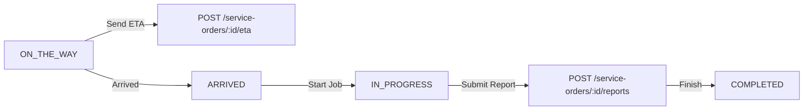

# 🚀 Frontend API Integration Guide (Phase-by-Phase)

Welcome to the **Elite Central Vacuum** API Integration Guide. This document provides a complete, step-by-step roadmap for frontend engineers (React, Next.js, Vue, Mobile) to integrate every feature domain of the backend.

---

## 📑 Table of Contents

- [Phase 0: Global Architecture & Client Setup](#phase-0-global-architecture--client-setup)
- [Phase 1: Authentication & User Accounts](#phase-1-authentication--user-accounts)
- [Phase 2: Product Categories & Taxonomy](#phase-2-product-categories--taxonomy)
- [Phase 3: Products Catalog, Filtering & Media](#phase-3-products-catalog-filtering--media)
- [Phase 4: Shopping Cart Management](#phase-4-shopping-cart-management)
- [Phase 5: Customer Delivery Addresses & Profile](#phase-5-customer-delivery-addresses--profile)
- [Phase 6: E-Commerce Orders, Checkout & Stripe Payment](#phase-6-e-commerce-orders-checkout--stripe-payment)
- [Phase 7: Central Vacuum Services Catalog & Scheduling](#phase-7-central-vacuum-services-catalog--scheduling)
- [Phase 8: Service Intake Requests & Attachments](#phase-8-service-intake-requests--attachments)
- [Phase 9: Quotations & Customer Approval](#phase-9-quotations--customer-approval)
- [Phase 10: Service Orders & Technician Dispatch](#phase-10-service-orders--technician-dispatch)
- [Phase 11: Real-Time WebSocket & In-App Notifications](#phase-11-real-time-websocket--in-app-notifications)
- [Phase 12: Invoicing, Payments & Refunds](#phase-12-invoicing-payments--refunds)
- [Phase 13: Customer Reviews & Ratings](#phase-13-customer-reviews--ratings)
- [Phase 14: Analytics, System Settings & AI Assistant](#phase-14-analytics-system-settings--ai-assistant)
- [Phase 15: CSV Data Export & Reporting](#phase-15-csv-data-export--reporting)
- [Phase 16: Live Real-Time Support Chat & WebSockets](#phase-16-live-real-time-support-chat--websockets)

---

## Phase 0: Global Architecture & Client Setup

### Base URLs & Environment
| Environment | REST API Base URL | WebSocket Gateway URL | Swagger Docs |
| :--- | :--- | :--- | :--- |
| **Development** | `http://localhost:5000/api/v1` | `ws://localhost:5000/notifications` | `http://localhost:5000/api/docs` |
| **Production** | `https://api.yourdomain.com/api/v1` | `wss://api.yourdomain.com/notifications` | `https://api.yourdomain.com/api/docs` |

### Standard Request Headers
```http
Content-Type: application/json
Accept: application/json
Authorization: Bearer <accessToken>
```

### Cookie Strategy (`credentials: 'include'`)
The backend uses a hybrid token strategy:
1. **Access Token (`accessToken`)**: Short-lived (15m–1h) returned in the response body. Store in memory (or secure client state).
2. **Refresh Token**: Long-lived (30d) automatically set in a secure `HttpOnly`, `SameSite: Lax/None` cookie named `refresh_token`. Ensure your HTTP client has `withCredentials: true` enabled.

### Standard Axios Setup
```typescript
import axios from 'axios';

export const apiClient = axios.create({
  baseURL: process.env.NEXT_PUBLIC_API_BASE_URL || 'http://localhost:5000/api/v1',
  withCredentials: true,
  headers: {
    'Content-Type': 'application/json',
  },
});

// Attach access token
apiClient.interceptors.request.use((config) => {
  const token = typeof window !== 'undefined' ? localStorage.getItem('access_token') : null;
  if (token && config.headers) {
    config.headers.Authorization = `Bearer ${token}`;
  }
  return config;
});

// Auto-refresh token on 401
apiClient.interceptors.response.use(
  (res) => res,
  async (err) => {
    const originalRequest = err.config;
    if (err.response?.status === 401 && !originalRequest._retry && !originalRequest.url?.includes('/auth/refresh-token')) {
      originalRequest._retry = true;
      try {
        const { data } = await apiClient.post('/auth/refresh-token');
        localStorage.setItem('access_token', data.accessToken);
        originalRequest.headers.Authorization = `Bearer ${data.accessToken}`;
        return apiClient(originalRequest);
      } catch (refreshErr) {
        localStorage.removeItem('access_token');
        window.location.href = '/login';
        return Promise.reject(refreshErr);
      }
    }
    return Promise.reject(err);
  }
);
```

### Standard Pagination Response Structure
All paginated GET endpoints follow this structure:
```json
{
  "items": [],
  "meta": {
    "page": 1,
    "limit": 10,
    "total": 45,
    "totalPages": 5,
    "hasNextPage": true,
    "hasPreviousPage": false,
    "kpi": {
      "active": 30,
      "pending": 15
    }
  }
}
```

---

## Phase 1: Authentication & User Accounts

### 1.1 Customer Registration
- **Endpoint**: `POST /auth/signup`
- **Access**: `Public`
- **Request Body**:
```json
{
  "email": "customer@example.com",
  "password": "SecurePassword123!",
  "firstName": "Jane",
  "lastName": "Doe",
  "phone": "+15552345678"
}
```
- **Response `201 Created`**:
```json
{
  "message": "Registration successful. A 5-digit verification code has been sent to your email."
}
```

### 1.2 Verify Email OTP
- **Endpoint**: `POST /auth/verify-otp`
- **Access**: `Public`
- **Request Body**:
```json
{
  "email": "customer@example.com",
  "otp": "48291"
}
```
- **Response `200 OK`**:
```json
{
  "message": "Email verified successfully. You may now log in."
}
```

### 1.3 Resend Verification OTP
- **Endpoint**: `POST /auth/resend-otp`
- **Access**: `Public`
- **Request Body**:
```json
{
  "email": "customer@example.com"
}
```

### 1.4 User Login
- **Endpoint**: `POST /auth/login`
- **Access**: `Public`
- **Request Body**:
```json
{
  "email": "customer@example.com",
  "password": "SecurePassword123!"
}
```
- **Response `200 OK`** (Sets `refresh_token` HttpOnly cookie):
```json
{
  "user": {
    "id": "c1f7b8d4-5390-4a88-bb71-d6fe2e79601f",
    "email": "customer@example.com",
    "firstName": "Jane",
    "lastName": "Doe",
    "fullName": "Jane Doe",
    "role": "CUSTOMER",
    "phone": "+15552345678",
    "isActive": true,
    "isEmailVerified": true
  },
  "accessToken": "eyJhbGciOiJIUzI1NiIsIn..."
}
```

### 1.5 Get Current Profile (`/me`)
- **Endpoint**: `GET /auth/me`
- **Access**: `Authenticated` (`CUSTOMER`, `ADMIN`, `TECHNICIAN`)
- **Response `200 OK`**: Returns current `user` object.

### 1.6 Refresh Token
- **Endpoint**: `POST /auth/refresh-token`
- **Access**: `Public` (Relies on `refresh_token` HttpOnly cookie)
- **Response `200 OK`**: Returns refreshed `accessToken` and user profile.

### 1.7 Forgot & Reset Password
- **Step 1**: `POST /auth/forgot-password` with `{"email": "customer@example.com"}`
- **Step 2**: `POST /auth/reset-password` with:
```json
{
  "email": "customer@example.com",
  "otp": "83719",
  "newPassword": "NewSecurePassword456!"
}
```

### 1.8 Change Password
- **Endpoint**: `POST /auth/change-password`
- **Access**: `Authenticated`
- **Request Body**:
```json
{
  "oldPassword": "SecurePassword123!",
  "newPassword": "BrandNewPassword789!"
}
```

### 1.9 Logout
- **Endpoint**: `POST /auth/logout`
- **Access**: `Authenticated`
- **Response `200 OK`**: Clears HttpOnly cookie and revokes session.

---

## Phase 2: Product Categories & Taxonomy

### 2.1 List Categories (with Active Product Counts)
- **Endpoint**: `GET /categories`
- **Access**: `Public`
- **Query Parameters**:
  - `search` *(string, optional)*
  - `status` *(enum: `ACTIVE`, `INACTIVE`, optional)*
  - `page` *(number, default 1)*
  - `limit` *(number, default 50)*
- **Response `200 OK`**:
```json
{
  "items": [
    {
      "id": "2e6d4ef0-71e5-4e1c-8fcb-2cfd4a8c8ed6",
      "name": "Central Vacuum Units",
      "slug": "central-vacuum-units",
      "description": "High powered, durable central vacuum power units.",
      "imageUrl": "https://res.cloudinary.com/demo/image/upload/units.jpg",
      "status": "ACTIVE",
      "sortOrder": 1,
      "productCount": 14
    }
  ],
  "meta": { "page": 1, "limit": 50, "total": 6, "totalPages": 1 }
}
```

### 2.2 Get Category by ID or Slug
- **Endpoint**: `GET /categories/:id` (Accepts UUID or slug `central-vacuum-units`)
- **Access**: `Public`

### 2.3 Admin Category Management
- **Create**: `POST /categories` (`ADMIN`)
- **Update**: `PATCH /categories/:id` (`ADMIN`)
- **Delete**: `DELETE /categories/:id` (`ADMIN` — Rejects if active products exist)

---

## Phase 3: Products Catalog, Filtering & Media

### 3.1 Public Product Catalog & Search
- **Endpoint**: `GET /products`
- **Access**: `Public`
- **Query Parameters**:
  - `search`: Search across name, description, SKU, and model.
  - `categoryId`: Filter by category UUID.
  - `categorySlug`: Filter by category slug (e.g. `central-vacuum-units`).
  - `minPrice` / `maxPrice`: Numerical price boundaries.
  - `brand`: Filter by manufacturer brand.
  - `isFeatured`: `true` or `false`.
  - `availability`: `IN_STOCK`, `LOW_STOCK`, `OUT_OF_STOCK`, `PREORDER`.
  - `sort`: `price_asc`, `price_desc`, `newest`, `popular`, `name_asc`.
  - `page` *(default 1)*, `limit` *(default 12)*.
- **Response `200 OK`**:
```json
{
  "items": [
    {
      "id": "7a8b9c0d-1e2f-3a4b-5c6d-7e8f9a0b1c2d",
      "sku": "PROD-202608-A19",
      "name": "Elite Pro Power Unit 850AW",
      "slug": "elite-pro-power-unit-850aw",
      "model": "EV-850",
      "brand": "Elite",
      "priceUsd": "899.99",
      "compareAtPriceUsd": "999.99",
      "quantity": 18,
      "availability": "IN_STOCK",
      "status": "ACTIVE",
      "isFeatured": true,
      "category": {
        "id": "2e6d4ef0-71e5-4e1c-8fcb-2cfd4a8c8ed6",
        "name": "Central Vacuum Units",
        "slug": "central-vacuum-units"
      },
      "images": [
        {
          "id": "img-01",
          "url": "https://res.cloudinary.com/demo/image/upload/v1/ev-850.jpg",
          "isPrimary": true,
          "sortOrder": 1
        }
      ]
    }
  ],
  "meta": { "page": 1, "limit": 12, "total": 34, "totalPages": 3 }
}
```

### 3.2 Product Detail by ID or Slug
- **Endpoint**: `GET /products/:id` (Accepts UUID, SKU `PROD-...`, or Slug `elite-pro-...`)
- **Access**: `Public`

### 3.3 Admin Product Creation (Multipart with Images)
- **Endpoint**: `POST /products`
- **Access**: `ADMIN`
- **Content-Type**: `multipart/form-data`
- **Fields**:
  - `data` *(stringified JSON)*:
    ```json
    {
      "name": "Elite Pro Power Unit 850AW",
      "slug": "elite-pro-power-unit-850aw",
      "model": "EV-850",
      "brand": "Elite",
      "price": 899.99,
      "stock": 25,
      "categoryId": "2e6d4ef0-71e5-4e1c-8fcb-2cfd4a8c8ed6",
      "description": "Quiet, commercial-grade 850 air-watt motor with hybrid HEPA filtration.",
      "isFeatured": true
    }
    ```
  - `images`: Binary file attachments (JPEG, PNG, WEBP; max 10 files).

### 3.4 Admin Quick Stock & Status Updates
- `PATCH /products/:id/stock` with `{"stock": 40}`
- `PATCH /products/:id/status` with `{"status": "ACTIVE", "availability": "IN_STOCK"}`

---

## Phase 4: Shopping Cart Management

The cart is tied to the customer's authenticated account and handles real-time subtotal calculation, tax estimation, and free shipping threshold qualification.

### 4.1 Get Active Cart & Order Summary
- **Endpoint**: `GET /store/cart`
- **Access**: `CUSTOMER`
- **Response `200 OK`**:
```json
{
  "id": "cart-uuid-001",
  "customerId": "cust-uuid-123",
  "items": [
    {
      "id": "item-uuid-01",
      "productId": "7a8b9c0d-1e2f-3a4b-5c6d-7e8f9a0b1c2d",
      "quantity": 1,
      "unitPriceUsd": "899.99",
      "totalUsd": "899.99",
      "product": {
        "name": "Elite Pro Power Unit 850AW",
        "sku": "PROD-202608-A19",
        "quantity": 18,
        "availability": "IN_STOCK",
        "images": [{ "url": "https://res.cloudinary.com/.../ev-850.jpg" }]
      }
    }
  ],
  "summary": {
    "itemCount": 1,
    "totalUnits": 1,
    "subtotalUsd": "899.99",
    "estimatedShippingUsd": "0.00",
    "freeShippingThreshold": "150.00",
    "qualifiesForFreeShipping": true,
    "amountNeededForFreeShipping": "0.00",
    "estimatedTaxUsd": "72.00",
    "estimatedTotalUsd": "971.99"
  }
}
```

### 4.2 Add Item to Cart
- **Endpoint**: `POST /store/cart/items`
- **Access**: `CUSTOMER`
- **Request Body**:
```json
{
  "productId": "7a8b9c0d-1e2f-3a4b-5c6d-7e8f9a0b1c2d",
  "quantity": 2
}
```

### 4.3 Update Cart Item Quantity
- **Endpoint**: `PATCH /store/cart/items/:itemId`
- **Access**: `CUSTOMER`
- **Request Body**: `{"quantity": 3}`

### 4.4 Remove Item & Clear Cart
- **Remove Item**: `DELETE /store/cart/items/:itemId`
- **Clear Entire Cart**: `DELETE /store/cart/clear`

---

## Phase 5: Customer Delivery Addresses & Profile

### 5.1 List Customer Saved Addresses
- **Endpoint**: `GET /store/addresses`
- **Access**: `CUSTOMER`
- **Response `200 OK`**:
```json
[
  {
    "id": "addr-uuid-01",
    "fullName": "Jane Doe",
    "street": "742 Evergreen Terrace",
    "apartment": "Apt 4B",
    "city": "Springfield",
    "state": "OR",
    "zipCode": "97477",
    "phone": "+15552345678",
    "isDefault": true
  }
]
```

### 5.2 Create Saved Address
- **Endpoint**: `POST /store/addresses`
- **Access**: `CUSTOMER`
- **Request Body**:
```json
{
  "fullName": "Jane Doe",
  "street": "742 Evergreen Terrace",
  "apartment": "Apt 4B",
  "city": "Springfield",
  "state": "OR",
  "zipCode": "97477",
  "phone": "+15552345678",
  "isDefault": true
}
```

### 5.3 Set Default Address
- **Endpoint**: `PATCH /store/addresses/:id/set-default`
- **Access**: `CUSTOMER`

---

## Phase 6: E-Commerce Orders, Checkout & Stripe Payment

### 6.1 Checkout Order from Cart
- **Endpoint**: `POST /store/orders`
- **Access**: `CUSTOMER`
- **Request Body**:
```json
{
  "deliveryAddressId": "addr-uuid-01",
  "paymentMethod": "CARD",
  "customerNotes": "Please leave on front porch behind pillar"
}
```
*(Options for `paymentMethod`: `CARD`, `COD` (Cash on Delivery), `CHECK`, `BANK_TRANSFER`)*

- **Response `201 Created` (When `paymentMethod: "CARD"`)**:
```json
{
  "success": true,
  "message": "Order created successfully. Redirect to Stripe checkout to complete payment.",
  "order": {
    "id": "ord-uuid-999",
    "businessId": "ORD-2026-0042",
    "status": "PENDING",
    "totalUsd": "971.99",
    "subtotalUsd": "899.99",
    "shippingFeeUsd": "0.00",
    "taxUsd": "72.00"
  },
  "checkoutUrl": "https://checkout.stripe.com/c/pay/cs_test_a1b2c3d4...",
  "stripeSessionId": "cs_test_a1b2c3d4..."
}
```

### 6.2 Get Customer Order History
- **Endpoint**: `GET /store/orders`
- **Access**: `CUSTOMER`
- **Query Parameters**: `status`, `page`, `limit`

### 6.3 Get Single Order Details & Live Tracking
- **Endpoint**: `GET /store/orders/:id` (Accepts UUID or `ORD-XXXXX`)
- **Access**: `CUSTOMER`, `ADMIN`
- **Response `200 OK`**:
```json
{
  "id": "ord-uuid-999",
  "businessId": "ORD-2026-0042",
  "status": "SHIPPED",
  "shippingProvider": "UPS Ground",
  "trackingNumber": "1Z9999999999999999",
  "placedAt": "2026-08-31T12:00:00Z",
  "totalUsd": "971.99",
  "items": [
    {
      "productName": "Elite Pro Power Unit 850AW",
      "quantity": 1,
      "unitPriceUsd": "899.99",
      "totalUsd": "899.99"
    }
  ],
  "statusHistory": [
    {
      "status": "PENDING",
      "note": "Order placed, awaiting payment",
      "createdAt": "2026-08-31T12:00:00Z"
    },
    {
      "status": "PROCESSING",
      "note": "Payment verified via Stripe",
      "createdAt": "2026-08-31T12:02:15Z"
    },
    {
      "status": "SHIPPED",
      "note": "Dispatched via UPS Ground (Tracking: 1Z9999999999999999)",
      "createdAt": "2026-08-31T14:30:00Z"
    }
  ],
  "invoice": {
    "id": "inv-uuid-11",
    "businessId": "INV-2026-0042",
    "status": "PAID"
  }
}
```

### 6.4 Cancel Order (Auto-Restores Inventory)
- **Endpoint**: `PATCH /store/orders/:id/cancel`
- **Access**: `CUSTOMER` (only when `PENDING`), `ADMIN`

---

## Phase 7: Central Vacuum Services Catalog & Scheduling

### 7.1 List Available Services
- **Endpoint**: `GET /services`
- **Access**: `Public`
- **Response `200 OK`**:
```json
[
  {
    "id": "srv-01",
    "name": "Central Vacuum Clog & Pipe Repair",
    "slug": "clog-pipe-repair",
    "description": "High-pressure diagnostic reverse flush and acoustic pipe locator.",
    "basePriceUsd": "149.00",
    "durationMinutes": 60,
    "commonSymptoms": ["LOW_SUCTION", "CLOGGED_PIPE", "WHISTLING_NOISE"]
  }
]
```

### 7.2 Check Available Booking Slots
- **Endpoint**: `GET /schedule/slots`
- **Access**: `Public` / `CUSTOMER`
- **Query Parameters**: `date=YYYY-MM-DD` (e.g. `?date=2026-09-15`)
- **Response `200 OK`**:
```json
{
  "date": "2026-09-15",
  "slots": [
    {
      "timeWindow": "08:00 AM - 10:00 AM",
      "available": true,
      "remainingCapacity": 3
    },
    {
      "timeWindow": "10:00 AM - 12:00 PM",
      "available": true,
      "remainingCapacity": 2
    },
    {
      "timeWindow": "01:00 PM - 03:00 PM",
      "available": false,
      "remainingCapacity": 0
    },
    {
      "timeWindow": "03:00 PM - 05:00 PM",
      "available": true,
      "remainingCapacity": 1
    }
  ]
}
```

---

## Phase 8: Service Intake Requests & Attachments

### 8.1 Submit Service Request (Multipart with Photos/Videos)
- **Endpoint**: `POST /service-requests`
- **Access**: `CUSTOMER` (Mandatory JWT auth)
- **Content-Type**: `multipart/form-data`
- **Fields**:
  - `data` *(stringified JSON)*:
    ```json
    {
      "serviceSlug": "clog-pipe-repair",
      "fullName": "Jane Doe",
      "phone": "+15552345678",
      "address": "742 Evergreen Terrace",
      "city": "Springfield",
      "state": "OR",
      "zipCode": "97477",
      "problemLocation": "2nd Floor Master Bedroom Inlet",
      "preferredDate": "2026-09-15",
      "timeWindow": "10:00 AM - 12:00 PM",
      "problemDescription": "Inlet valve clicks open but provides no suction.",
      "symptoms": ["LOW_SUCTION"],
      "manufacturer": "Beam",
      "modelNumber": "Serenity 375",
      "unitLocation": "Garage"
    }
    ```
  - `attachments`: File uploads (Photos/Videos/Inlet photos).
- **Response `201 Created`**:
```json
{
  "success": true,
  "message": "Service intake request created and booked for review",
  "request": {
    "id": "req-uuid-001",
    "businessId": "REQ-2026-0089",
    "status": "SUBMITTED",
    "preferredDate": "2026-09-15",
    "preferredTime": "10:00 AM - 12:00 PM"
  }
}
```

### 8.2 Customer Service Requests History
- **Endpoint**: `GET /service-requests/me`
- **Access**: `CUSTOMER`

---

## Phase 9: Quotations & Customer Approval

### 9.1 View Received Quotation
- **Endpoint**: `GET /quotations/:id` (UUID or `QUO-XXXXX`)
- **Access**: `CUSTOMER`, `ADMIN`
- **Response `200 OK`**:
```json
{
  "id": "quo-uuid-101",
  "businessId": "QUO-2026-0045",
  "status": "SENT",
  "subtotalUsd": "220.00",
  "discountUsd": "20.00",
  "taxUsd": "16.00",
  "totalUsd": "216.00",
  "lineItems": [
    {
      "description": "Diagnostic & Heavy Duty Reverse Pipe Flush",
      "quantity": 1,
      "unitPriceUsd": "150.00",
      "totalUsd": "150.00"
    },
    {
      "description": "Replacement Low-Voltage Wall Inlet Valve (White)",
      "quantity": 2,
      "unitPriceUsd": "35.00",
      "totalUsd": "70.00"
    }
  ]
}
```

### 9.2 Accept Quotation (Auto-Provisions Service Order)
- **Endpoint**: `POST /quotations/:id/accept`
- **Access**: `CUSTOMER`
- **Response `200 OK`**:
```json
{
  "success": true,
  "message": "Quotation accepted and Service Order generated successfully",
  "serviceOrder": {
    "id": "so-uuid-777",
    "businessId": "SO-2026-0045",
    "status": "SCHEDULED",
    "scheduledAt": "2026-09-16T14:00:00Z"
  }
}
```

### 9.3 Reject Quotation
- **Endpoint**: `POST /quotations/:id/reject`
- **Access**: `CUSTOMER`
- **Request Body**:
```json
{
  "reason": "Price is higher than expected. Would like to proceed with pipe flush only."
}
```

---

## Phase 10: Service Orders & Technician Dispatch

### 10.1 Customer View Service Order Timeline & ETA
- **Endpoint**: `GET /service-orders/:id`
- **Access**: `CUSTOMER`, `ADMIN`, `TECHNICIAN`
- **Response `200 OK`**:
```json
{
  "id": "so-uuid-777",
  "businessId": "SO-2026-0045",
  "status": "ON_THE_WAY",
  "scheduledAt": "2026-09-16T14:00:00Z",
  "technician": {
    "id": "tech-uuid-01",
    "displayName": "Dave Miller",
    "phone": "+15559876543",
    "avatarUrl": "https://res.cloudinary.com/.../tech-dave.jpg"
  },
  "etas": [
    {
      "etaMinutes": 18,
      "note": "Departing previous job in Springfield, GPS en route",
      "updatedAt": "2026-09-16T13:42:00Z"
    }
  ]
}
```

### 10.2 Technician / Admin Update Status
- **Endpoint**: `PATCH /service-orders/:id/status`
- **Access**: `TECHNICIAN`, `ADMIN`
- **Request Body**:
```json
{
  "status": "ARRIVED",
  "note": "Parked in driveway, beginning diagnostic check"
}
```
*(Status workflow: `SCHEDULED` $\rightarrow$ `TECHNICIAN_ASSIGNED` $\rightarrow$ `ON_THE_WAY` $\rightarrow$ `ARRIVED` $\rightarrow$ `IN_PROGRESS` $\rightarrow$ `COMPLETED` $\rightarrow$ `CANCELLED`)*

---

## Phase 11: Real-Time WebSocket & In-App Notifications

### 11.1 WebSocket Connection Setup
- **URL**: `ws://<host>:<port>/notifications?token=<accessToken>`
- **Transport**: `['websocket']` (Socket.IO client or standard WSS)

```typescript
import { io } from 'socket.io-client';

const socket = io('http://localhost:5000/notifications', {
  query: {
    token: localStorage.getItem('access_token'),
  },
  transports: ['websocket'],
});

// Listen for incoming notifications
socket.on('notification:new', (notification) => {
  console.log('New notification:', notification);
  // Show toast & increment unread badge counter
  playNotificationSound();
  updateUnreadBadgeCount((prev) => prev + 1);
});

// Listen for read-all broadcasts
socket.on('notification:read_all', () => {
  updateUnreadBadgeCount(0);
});
```

### 11.2 Notifications REST Endpoints
| Action | Method | Route | Description |
| :--- | :--- | :--- | :--- |
| **Get Inbox** | `GET` | `/notifications` | Paginated notifications with `isRead` filter |
| **Fast Unread Count** | `GET` | `/notifications/unread-count` | Returns `{"unreadCount": 3}` for badge header |
| **Mark Single Read** | `PATCH` | `/notifications/:id/read` | Marks notification as read |
| **Mark All Read** | `PATCH` | `/notifications/read-all` | Marks all as read & broadcasts via WSS |
| **Delete** | `DELETE` | `/notifications/:id` | Removes from inbox |

---

## Phase 12: Invoicing, Payments & Refunds

### 12.1 Get Invoices List
- **Endpoint**: `GET /billing/invoices/me`
- **Access**: `CUSTOMER`

### 12.2 Pay Invoice via Stripe (Online Card / Apple Pay)
- **Step 1 — Create Stripe PaymentIntent**:
  - `POST /billing/invoices/:id/stripe/payment-intent`
  - Returns: `{"clientSecret": "pi_3MtwBwLkdIwHu7ix28a3tqPa_secret_..."}`
- **Step 2 — Mount Stripe Elements**:
  - Confirm card payment on client with `stripe.confirmCardPayment(clientSecret)`.
- **Step 3 — Confirm Payment on Backend**:
  - `POST /billing/invoices/:id/stripe/confirm`
  - Body: `{"paymentIntentId": "pi_3MtwBwLkdIwHu7ix28a3tqPa"}`
  - Automatically marks invoice `PAID` and sends receipt email.

### 12.3 View Printable HTML Invoice
- **Endpoint**: `GET /billing/invoices/:id/html`
- **Access**: `CUSTOMER`, `ADMIN` (Returns formatted HTML ready for printing or PDF save)

---

## Phase 13: Customer Reviews & Ratings

### 13.1 Public Reviews List & Average Rating
- **Endpoint**: `GET /reviews`
- **Access**: `Public`
- **Response `200 OK`**:
```json
{
  "ratingSummary": {
    "averageRating": 4.9,
    "totalReviews": 128,
    "distribution": { "5": 115, "4": 10, "3": 2, "2": 1, "1": 0 }
  },
  "items": [
    {
      "id": "rev-01",
      "authorName": "Jane D.",
      "rating": 5,
      "title": "Unbelievable suction power!",
      "comment": "The installation was spotless and the pipe clog was cleared in under an hour.",
      "serviceType": "Clog & Pipe Repair",
      "verifiedPurchase": true,
      "createdAt": "2026-08-31T10:00:00Z"
    }
  ]
}
```

### 13.2 Submit Review
- **Endpoint**: `POST /reviews`
- **Access**: `CUSTOMER`
- **Request Body**:
```json
{
  "serviceOrderId": "so-uuid-777",
  "rating": 5,
  "title": "Outstanding technician!",
  "comment": "Dave arrived right on time and fixed all our second-floor suction issues."
}
```

---

## Phase 14: Analytics, System Settings & AI Assistant

### 14.1 Stream AI Assistant (Gemini 2.5)
- **Endpoint**: `POST /ai/chat/stream`
- **Access**: `Authenticated` (`CUSTOMER`, `ADMIN`, `TECHNICIAN`)
- **Content-Type**: `text/event-stream` (Server-Sent Events)
- **Request Body**:
```json
{
  "message": "What is the recommended air-watt rating for a 4,500 sq ft home?"
}
```

### 14.2 Public Business Profile & FAQs
- `GET /settings/business-profile` — Contact info, service coverage notes, operating hours.
- `GET /settings/faqs` — Frequently asked questions grouped by categories.
- `GET /settings/policies` — Shipping, Return, and Warranty policies.

---

## Phase 15: CSV Data Export & Reporting

The backend provides direct streaming CSV download endpoints for administrative reporting. Headers include standard `Content-Disposition: attachment; filename="..."` and `Content-Type: text/csv`.

### 15.1 Export Orders Report (CSV)
- **Endpoint**: `GET /reports/export/orders/csv`
- **Access**: `ADMIN`
- **Query Parameters**:
  - `period`: `7d` | `30d` | `90d` | `1y`
  - `from`: `YYYY-MM-DD`
  - `to`: `YYYY-MM-DD`
- **Headers Returned**:
  ```http
  Content-Type: text/csv
  Content-Disposition: attachment; filename="orders_report.csv"
  ```
- **Example Frontend Trigger (Blob Download)**:
  ```typescript
  const downloadOrdersCsv = async () => {
    const response = await apiClient.get('/reports/export/orders/csv', {
      responseType: 'blob',
    });
    const url = window.URL.createObjectURL(new Blob([response.data]));
    const link = document.createElement('a');
    link.href = url;
    link.setAttribute('download', 'orders_report.csv');
    document.body.appendChild(link);
    link.click();
    link.remove();
  };
  ```

### 15.2 Export Service Requests Report (CSV)
- **Endpoint**: `GET /reports/export/service-requests/csv`
- **Access**: `ADMIN`
- **Columns**: `Request ID, Business ID, Customer Name, Customer Email, Service Name, Status, Urgency, Preferred Date, Preferred Time, City / State, Submitted At`

### 15.3 Export Customers Report (CSV)
- **Endpoint**: `GET /reports/export/customers/csv`
- **Access**: `ADMIN`
- **Columns**: `Customer ID, Display Name, Email, Phone, Cellphone, Company, Status, Product Orders Count, Service Orders Count, Total Product Spend (USD), Total Service Spend (USD), Joined At`

### 15.4 Export Invoices Report (CSV)
- **Endpoint**: `GET /reports/export/invoices/csv`
- **Access**: `ADMIN`
- **Columns**: `Invoice ID, Business ID, Customer Name, Customer Email, Status, Subtotal (USD), Tax (USD), Discount (USD), Total (USD), Due Date, Created At`

---

## Phase 16: Live Real-Time Support Chat & WebSockets

A complete enterprise chat system built with **Socket.io (`/chat` namespace)**, **Redis Pub/Sub** (multi-node broadcast), **Redis Presence** (live online tracking), and **BullMQ delayed queue** (offline email alerts if recipient does not read within 2 minutes).

### 16.1 WebSocket Gateway Architecture (`/chat`)

- **Connection URL**: `ws://localhost:4000/chat` (or `wss://api.yourdomain.com/chat`)
- **Authentication**: Pass Bearer token via `auth.token` or `extraHeaders.authorization`:
```typescript
import { io } from 'socket.io-client';

const chatSocket = io('http://localhost:4000/chat', {
  auth: {
    token: localStorage.getItem('accessToken'),
  },
  transports: ['websocket'],
});

chatSocket.on('connect', () => {
  console.log('Connected to Live Support Chat Gateway');
});
```

### 16.2 Real-Time WebSocket Events Table

| Event Name | Direction | Payload Schema | Purpose |
| :--- | :--- | :--- | :--- |
| `chat:join_conversation` | Client ➔ Server | `{ "conversationId": "conv-uuid" }` | Subscribe socket to specific chat room |
| `chat:send_message` | Client ➔ Server | `{ "conversationId": "conv-uuid", "content": "Hello!" }` | Send message in real-time |
| `chat:typing` | Client ➔ Server | `{ "conversationId": "conv-uuid", "isTyping": true }` | Send live typing indicator |
| `chat:mark_read` | Client ➔ Server | `{ "conversationId": "conv-uuid" }` | Mark all room messages read |
| `chat:message_received` | Server ➔ Client | `{ "conversationId": "...", "message": { ... } }` | Instant real-time message received (<10ms) |
| `chat:typing_update` | Server ➔ Client | `{ "conversationId": "...", "userId": "...", "isTyping": true }` | Show/hide "... is typing" banner |
| `chat:read_receipt_update` | Server ➔ Client | `{ "conversationId": "...", "userId": "...", "readAt": "..." }` | Update double-check checkmarks |

### 16.3 REST Endpoints (Conversations & Fallbacks)

#### 1. Start / Get Support Conversation
- **Endpoint**: `POST /chat/conversations`
- **Access**: `CUSTOMER`, `ADMIN`
- **Request Body**:
```json
{
  "type": "SUPPORT",
  "title": "Need help with Central Vacuum Unit",
  "initialMessage": "Hi! Can a technician check my attic piping?"
}
```
- **Response `201 Created`**:
```json
{
  "id": "c5f3e281-79b8-4c12-8822-10f8ad138d82",
  "type": "SUPPORT",
  "title": "Need help with Central Vacuum Unit",
  "participants": [
    { "userId": "cust-uuid-1", "roleInChat": "CUSTOMER" },
    { "userId": "admin-uuid-1", "roleInChat": "ADMIN" }
  ],
  "createdAt": "2026-08-31T17:40:00.000Z"
}
```

#### 2. List Conversations (with Unread Counts & Online Status)
- **Endpoint**: `GET /chat/conversations`
- **Access**: `Authenticated`
- **Response `200 OK`**:
```json
{
  "items": [
    {
      "id": "c5f3e281-79b8-4c12-8822-10f8ad138d82",
      "type": "SUPPORT",
      "title": "Need help with Central Vacuum Unit",
      "unreadCount": 2,
      "isOtherOnline": true,
      "lastMessage": {
        "content": "Our technician can arrive on Wednesday at 10 AM.",
        "createdAt": "2026-08-31T17:42:00.000Z"
      }
    }
  ],
  "meta": { "totalItems": 1, "currentPage": 1, "totalPages": 1 }
}
```

#### 3. Total Unread Badge Count
- **Endpoint**: `GET /chat/unread-count`
- **Access**: `Authenticated`
- **Response `200 OK`**:
```json
{
  "success": true,
  "unreadCount": 3
}
```

#### 4. Get Conversation Message History
- **Endpoint**: `GET /chat/conversations/:id/messages`
- **Access**: `CUSTOMER`, `ADMIN` (Participants only)
- **Query Parameters**: `?page=1&limit=30&before=ISO_DATE`
- **Response `200 OK`**:
```json
{
  "items": [
    {
      "id": "msg-001",
      "conversationId": "c5f3e281-...",
      "content": "Hello! I have a question about the vacuum motor.",
      "type": "TEXT",
      "isRead": true,
      "sender": {
        "id": "cust-01",
        "firstName": "Jane",
        "lastName": "Doe",
        "role": "CUSTOMER"
      },
      "attachments": [],
      "createdAt": "2026-08-31T17:40:00.000Z"
    }
  ],
  "meta": { "totalItems": 1, "currentPage": 1, "totalPages": 1 }
}
```

#### 5. Send Message (REST with Direct Photo/File Upload)
- **Endpoint**: `POST /chat/conversations/:id/messages`
- **Access**: `CUSTOMER`, `ADMIN`
- **Content-Type**: `multipart/form-data`
- **Body**:
  - `data`: `{"content": "Here is a photo of the clogged wall inlet"}`
  - `attachments`: `[file.jpg]` (up to 5 files, uploaded to Cloudinary automatically)

#### 6. Mark Conversation Read
- **Endpoint**: `PATCH /chat/conversations/:id/read`
- **Access**: `CUSTOMER`, `ADMIN`
- **Response `200 OK`**:
```json
{
  "success": true,
  "readAt": "2026-08-31T17:45:00.000Z"
}
```

---

## 🛠️ Phase 17: Field Technician Portal & Mobile App

### 🔀 Unified Auth & Role-Based Navigation
All users (Customers, Admins, Technicians) authenticate through the **same** login endpoint:
- **`POST /auth/login`** returns `{ token, refreshToken, user: { id, email, role: "TECHNICIAN" | "ADMIN" | "CUSTOMER" } }`.
- The Frontend router inspects `user.role`:
  - `CUSTOMER` $\rightarrow$ Redirect to `/account` or store shopping flow.
  - `ADMIN` $\rightarrow$ Redirect to `/admin/dashboard`.
  - `TECHNICIAN` $\rightarrow$ Redirect to `/technician/overview`.

---

### 17.1 Screen 1: Technician Overview & Dashboard
- **Endpoint**: `GET /technicians/me/overview`
- **Access**: `TECHNICIAN`
- **Response `200 OK`**:
```json
{
  "summary": {
    "availability": "AVAILABLE",
    "todayJobsCount": 2,
    "activeJobsCount": 1,
    "completedTodayCount": 1,
    "upcomingJobsCount": 4,
    "completedTotalCount": 104
  },
  "todaySchedule": [
    {
      "appointmentId": "uuid-apt-1",
      "serviceOrderId": "uuid-so-1",
      "businessId": "SO-10023",
      "serviceName": "Central Vacuum Pipe Unclogging",
      "timeWindow": "09:00 AM - 11:00 AM",
      "status": "CONFIRMED",
      "customerName": "John Doe",
      "customerPhone": "+1 555-0199",
      "propertyAddress": "123 Ocean Ave, Suite 400, Brooklyn, NY"
    }
  ],
  "nextAppointment": {
    "appointmentId": "uuid-apt-2",
    "serviceOrderId": "uuid-so-2",
    "businessId": "SO-10024",
    "serviceName": "Full Inlet System Diagnostic & Motor Inspection",
    "scheduledDate": "2026-09-01T13:00:00.000Z",
    "timeWindow": "01:00 PM - 03:00 PM",
    "status": "CONFIRMED",
    "customerName": "Alice Smith",
    "customerPhone": "+1 555-0234",
    "propertyAddress": "742 Evergreen Terrace, Staten Island, NY"
  },
  "upcomingJobs": [
    {
      "appointmentId": "uuid-apt-3",
      "serviceOrderId": "uuid-so-3",
      "businessId": "SO-10025",
      "serviceName": "Annual System Tune-Up",
      "scheduledDate": "2026-09-02T10:00:00.000Z",
      "timeWindow": "10:00 AM - 12:00 PM",
      "status": "CONFIRMED",
      "customerName": "Robert Vance",
      "propertyAddress": "55 Wallaby Way, Queens, NY"
    }
  ],
  "recentlyCompleted": [
    {
      "serviceOrderId": "uuid-so-0",
      "businessId": "SO-10020",
      "serviceName": "Filter Replacement & Suction Test",
      "customerName": "Eleanor Shellstrop",
      "completedAt": "2026-08-31T15:30:00.000Z",
      "totalAmountUsd": "185.00"
    }
  ]
}
```

---

### 17.2 Screen 2: My Assigned Jobs
- **Endpoint**: `GET /technicians/me/jobs`
- **Access**: `TECHNICIAN`
- **Query Params**:
  - `tab`: `today` | `upcoming` | `in_progress` | `completed` | `all` (default: `all`)
  - `page`: `1`
  - `limit`: `20`
- **Response `200 OK`**:
```json
{
  "counts": {
    "today": 2,
    "upcoming": 4,
    "active": 1,
    "completed": 104
  },
  "items": [
    {
      "id": "uuid-so-1",
      "businessId": "SO-10023",
      "status": "IN_PROGRESS",
      "scheduledDate": "2026-08-31T09:00:00.000Z",
      "timeWindow": "09:00 AM - 11:00 AM",
      "customer": {
        "id": "uuid-cust-1",
        "displayName": "John Doe",
        "phone": "+1 555-0199",
        "email": "john@example.com"
      },
      "propertyAddress": "123 Ocean Ave, Brooklyn, NY",
      "service": {
        "name": "Central Vacuum Pipe Unclogging",
        "slug": "central-vac-unclogging"
      },
      "symptoms": ["Zero suction on 2nd floor", "Whistling noise near utility closet"],
      "etaMinutes": 10,
      "totalAmountUsd": "249.00",
      "createdAt": "2026-08-30T10:00:00.000Z"
    }
  ],
  "meta": { "totalItems": 1, "currentPage": 1, "totalPages": 1 }
}
```

---

### 17.3 Screen 3: Schedule Calendar & Change Requests
#### 1. View Calendar Schedule
- **Endpoint**: `GET /technicians/me/schedule`
- **Access**: `TECHNICIAN`
- **Query Params**: `from=2026-08-31&to=2026-09-07`
- **Response `200 OK`**:
```json
{
  "range": {
    "from": "2026-08-31T00:00:00.000Z",
    "to": "2026-09-07T00:00:00.000Z"
  },
  "days": [
    {
      "date": "2026-08-31",
      "isToday": true,
      "appointmentsCount": 2,
      "appointments": [
        {
          "id": "uuid-apt-1",
          "serviceOrderId": "uuid-so-1",
          "businessId": "SO-10023",
          "serviceName": "Central Vacuum Pipe Unclogging",
          "timeWindow": "09:00 AM - 11:00 AM",
          "status": "CONFIRMED",
          "customerName": "John Doe",
          "customerPhone": "+1 555-0199",
          "propertyAddress": "123 Ocean Ave, Brooklyn, NY"
        }
      ]
    }
  ]
}
```

#### 2. Request Schedule Change
- **Endpoint**: `POST /technicians/me/schedule-change-request`
- **Access**: `TECHNICIAN`
- **Body**:
```json
{
  "serviceOrderId": "uuid-so-1",
  "reason": "Customer requested reschedule due to plumbing emergency at property",
  "proposedDate": "2026-09-02",
  "proposedTimeWindow": "02:00 PM - 04:00 PM"
}
```
- **Response `201 Created`**:
```json
{
  "success": true,
  "message": "Schedule change request submitted to admin team"
}
```

---

### 17.4 Screen 4: Technician Profile & Stats
#### 1. Get Profile Details
- **Endpoint**: `GET /technicians/me/profile`
- **Access**: `TECHNICIAN`
- **Response `200 OK`**:
```json
{
  "id": "uuid-tech-1",
  "userId": "uuid-user-1",
  "displayName": "Alex Rivera",
  "email": "alex.tech@elitevacuum.com",
  "phone": "+1 555-0188",
  "role": "TECHNICIAN",
  "status": "ACTIVE",
  "availability": "AVAILABLE",
  "timezone": "America/New_York",
  "avatarUrl": "https://res.cloudinary.com/.../avatar.jpg",
  "bio": "Certified Master Technician specializing in residential & commercial central vacuum infrastructure with 8+ years experience.",
  "specializations": ["Central Vacuum Installation", "Pipe Unclogging", "Motor Diagnostics", "Retraflex Hose Systems"],
  "stats": {
    "completedJobs": 104,
    "jobsThisMonth": 12,
    "upcomingAssignments": 4,
    "joinedAt": "2024-03-15T00:00:00.000Z"
  }
}
```

#### 2. Update Profile Information
- **Endpoint**: `PATCH /technicians/me/profile`
- **Access**: `TECHNICIAN`
- **Body**:
```json
{
  "displayName": "Alex Rivera, Sr. Tech",
  "phone": "+1 555-0190",
  "bio": "Updated bio text here...",
  "specializations": ["Central Vac Specialist", "Pipe Unclogging", "Smart Unit Retrofits"]
}
```

#### 3. Upload / Change Photo
- **Endpoint**: `POST /technicians/me/photo`
- **Access**: `TECHNICIAN`
- **Content-Type**: `multipart/form-data`
- **Body**: `file`: image file (JPEG / PNG / WebP)
- **Response `200 OK`**:
```json
{
  "success": true,
  "avatarUrl": "https://res.cloudinary.com/elite-vac/image/upload/v1234/technicians/tech-1.jpg"
}
```

#### 4. Remove Photo
- **Endpoint**: `DELETE /technicians/me/photo`
- **Access**: `TECHNICIAN`
- **Response `200 OK`**:
```json
{
  "success": true,
  "message": "Technician photo removed successfully"
}
```

---

### 17.5 Screen 5: Real-Time Availability & Settings
- **Endpoint**: `PATCH /technicians/me/availability`
- **Access**: `TECHNICIAN`
- **Body**:
```json
{
  "availability": "AVAILABLE",
  "timezone": "America/New_York"
}
```
> **Supported Availability Modes**: `AVAILABLE` | `BUSY` | `ON_BREAK` | `OFF_DUTY`

- **Response `200 OK`**:
```json
{
  "id": "uuid-tech-1",
  "availability": "AVAILABLE",
  "timezone": "America/New_York",
  "updatedAt": "2026-08-31T18:00:00.000Z"
}
```

---

### 17.6 Field Execution Flow (Technician on Site)



#### 1. Update Job Status
- **Endpoint**: `PATCH /service-orders/:id/status`
- **Access**: `TECHNICIAN`, `ADMIN`
- **Body**:
```json
{
  "status": "ON_THE_WAY",
  "note": "En route to client property, ETA 15 mins"
}
```
*(Valid transitions: `SCHEDULED` $\rightarrow$ `ON_THE_WAY` $\rightarrow$ `ARRIVED` $\rightarrow$ `IN_PROGRESS` $\rightarrow$ `COMPLETED`)*

#### 2. Send Live ETA Update
- **Endpoint**: `POST /service-orders/:id/eta`
- **Access**: `TECHNICIAN`
- **Body**:
```json
{
  "minutes": 15,
  "note": "Light traffic on expressway"
}
```

#### 3. Submit Field Diagnostic & Completion Report
- **Endpoint**: `POST /service-orders/:id/reports`
- **Access**: `TECHNICIAN`
- **Body**:
```json
{
  "diagnosisFindings": "Heavy paper towel obstruction lodged at 2nd floor junction elbow.",
  "workPerformed": "Used high-pressure reverse air snake to clear blockage. Tested all 6 wall inlets for airtight vacuum seal.",
  "technicianNotes": "System is now operating at peak 135 CFM suction.",
  "recommendations": "Advised customer to replace carbon motor brushes in 6 months.",
  "partsUsed": [
    { "partName": "2-Inch Vacuum Coupling", "quantity": 1, "costUsd": 12.50 }
  ]
}
```

---

## 🎯 Summary Checklist for Frontend Teams

| Step | Feature Domain | Status | Key Component to Build |
| :--- | :--- | :--- | :--- |
| **Phase 1** | Auth & User Profile | Ready | Auth Modal / Login / Register / OTP Screen |
| **Phase 2** | Categories | Ready | Mega Menu & Category Navigation Grid |
| **Phase 3** | Products Catalog | Ready | Product Grid, Filter Sidebar, Product Page |
| **Phase 4** | Shopping Cart | Ready | Slide-Over Cart Drawer & Summary Card |
| **Phase 5** | Addresses & Profile | Ready | Address Book Modal & Default Selector |
| **Phase 6** | Checkout & Orders | Ready | Stripe Checkout Redirect & Order Tracking Page |
| **Phase 7** | Services & Slots | Ready | Service Booking Wizard & Slot Picker |
| **Phase 8** | Service Intake | Ready | Multi-step Intake Form with Photo Upload |
| **Phase 9** | Quotations | Ready | Itemized Quote Review & Accept/Reject Modal |
| **Phase 10** | Service Orders | Ready | Live Dispatch Tracking & Technician ETA Card |
| **Phase 11** | Notifications | Ready | WebSocket Listener & Bell Inbox Drawer |
| **Phase 12** | Invoices & Billing | Ready | Invoice Table, Stripe Payment Modal & HTML Print |
| **Phase 13** | Reviews | Ready | Star Rating Display & Review Submission Modal |
| **Phase 14** | AI & Settings | Ready | Floating AI Support Chatbot & Policy Pages |
| **Phase 15** | CSV Reports & Export | Ready | One-Click CSV Export Action Buttons in Admin Panel |
| **Phase 16** | Live Support Chat | Ready | Floating Customer Chat Drawer & Admin Live Inbox |
| **Phase 17** | Technician Field Portal | Ready | 5-Screen Mobile-Responsive Field App & Status Transitions |


