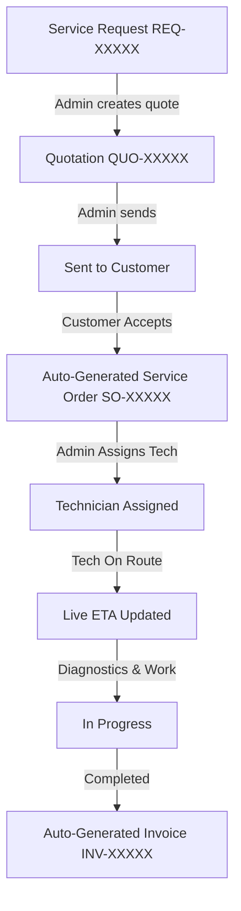

# Elite Central Vacuum - Master API & Frontend Integration Guide

Welcome to the unified, end-to-end API documentation for the **Elite Central Vacuum** platform. This guide consolidates all backend endpoints across **E-Commerce**, **Service Operations**, **Quotations**, **Service Orders**, **Billing & Invoices**, **Team Dispatch**, **Customer Reviews**, **Analytics & Reports**, and **System Settings**.

---

## Table of Contents
1. [Platform Architecture & Role Access Matrix](#1-platform-architecture--role-access-matrix)
2. [E-Commerce Store & Products Domain](#2-e-commerce-store--products-domain)
3. [Fixed Services Catalog & Schedule Dispatch](#3-fixed-services-catalog--schedule-dispatch)
4. [Quotations & Service Orders Lifecycle](#4-quotations--service-orders-lifecycle)
5. [Billing, Unified Invoices & Payments](#5-billing-unified-invoices--payments)
6. [Team & Technicians Management](#6-team--technicians-management)
7. [Customer Reviews & Moderation](#7-customer-reviews--moderation)
8. [Insights, Analytics & Reports Engine](#8-insights-analytics--reports-engine)
9. [System Settings & Configuration](#9-system-settings--configuration)

---

## 1. Platform Architecture & Role Access Matrix

### Base URL & Global Headers
- **Local Dev Base URL**: `http://localhost:3000`
- **Swagger Documentation**: `http://localhost:3000/docs`
- **Authentication Header**: `Authorization: Bearer <JWT_ACCESS_TOKEN>`

### Role Permissions Matrix

| Domain / Action | Public (`No Token`) | Customer (`@Roles('CUSTOMER')`) | Technician (`@Roles('TECHNICIAN')`) | Admin (`@Roles('ADMIN')`) |
| :--- | :---: | :---: | :---: | :---: |
| **Catalog & Products** | Read Only | Read Only | Read Only | Full Admin CRUD |
| **Cart & Checkout** | - | Full Access | - | - |
| **Store Orders** | - | Own Orders | - | Full Management |
| **Services Catalog** | Read Only | Read Only | Read Only | Read / Seed |
| **Service Requests** | Submit Guest / Lead | Submit & Own Requests | Assigned Requests | Full Triage & Status Badges |
| **Schedule & Dispatch**| View Available Slots | Book Slot | Assigned Schedule | Dispatch Board & Bookings |
| **Quotations** | - | View / Accept / Reject | - | Create / Revise / Send |
| **Service Orders** | - | View Own Orders | Assigned Jobs / ETA | Full CRUD, Assign Tech, Status |
| **Billing & Invoices** | - | View Own Invoices | - | Full CRUD, Payments, Refunds |
| **Technicians** | - | - | Self Profile | Full Management & Leaderboard |
| **Customer Reviews** | Read Published | **Submit Review** | - | Moderation (Publish/Hide/Delete)|
| **Reports & Analytics**| - | - | - | Executive Dashboard & KPIs |
| **System Settings** | Read Profile/FAQs/Policies | Read Profile/FAQs/Policies | Read | Full Configuration CRUD |

---

## 2. E-Commerce Store & Products Domain

### Product Categories
* **`GET /store/categories`** (Public)
  - Returns active categories sorted by `sortOrder` with `slug`, `name`, `icon`, `imageUrl`, and `productsCount`.

### Products
* **`GET /store/products`** (Public)
  - **Query Params**: `categoryId`, `categorySlug`, `search`, `minPrice`, `maxPrice`, `availability`, `sortBy` (`price_asc`, `price_desc`, `newest`, `popularity`), `page`, `limit`.
* **`GET /store/products/:slugOrId`** (Public)
  - Returns product specifications, bullet highlights, gallery images (`images: ProductImage[]`), shipping notes, stock status, and published customer reviews.
* **`POST /store/products`** (Admin)
  - Create product with highlights, specs, images, SKU, and price.
* **`PATCH /store/products/:id`** & **`DELETE /store/products/:id`** (Admin)
  - Update or archive product.

### Shopping Cart
* **`GET /store/cart`** (Customer)
  - Get active cart with itemized products, quantities, subtotal, tax estimation, and total.
* **`POST /store/cart/items`** (Customer)
  - Add item to cart (`productId`, `quantity`).
* **`PATCH /store/cart/items/:itemId`** (Customer)
  - Update quantity (`quantity: 0` removes item).
* **`DELETE /store/cart/items/:itemId`** (Customer)
  - Remove item from cart.

### Store Orders & Checkout
* **`POST /store/orders/checkout`** (Customer)
  - Placed from active cart. Generates `ORD-YYYYMMDD-XXXXX`.
  - Supports `shippingAddressId` (or new delivery address snapshot) and `paymentMethod: "STRIPE" | "COD"`.
* **`GET /store/orders/me`** (Customer)
  - Customer's past orders with shipment tracking and status.
* **`GET /store/orders`** (Admin)
  - Admin management list with KPI counters (`PENDING`, `PAID`, `PROCESSING`, `SHIPPED`, `DELIVERED`, `CANCELLED`).
* **`PATCH /store/orders/:id/status`** (Admin)
  - Transition order status with tracking number and carrier.

---

## 3. Fixed Services Catalog & Schedule Dispatch

### Fixed Offerings & Symptom Checkboxes
The catalog contains 10 fixed offerings across two groups:
- **Group 1: `SERVICE_AND_MAINTENANCE`**
  1. `vacuum-repair` ("Vacuum Repair", Icon: `Wrench`)
  2. `maintenance-troubleshooting` ("Maintenance & Troubleshooting", Icon: `Pulse`)
  3. `low-suction-fix` ("Low Suction Fix", Icon: `Zap`)
  4. `pipe-unclogging` ("Pipe Unclogging", Icon: `Layers`)
  5. `inspection-tune-up` ("Inspection & Tune-up", Icon: `CheckCircle`)
  6. `motor-noise-diagnostics` ("Motor & Noise Diagnostics", Icon: `Activity`)
- **Group 2: `INSTALLATION`**
  7. `new-system-installation` ("New System Installation", Icon: `Sparkles`)
  8. `replacement-upgrade` ("Replacement & Upgrade", Icon: `Package`)
  9. `inlet-valve-expansion` ("Inlet Valve Expansion", Icon: `PlusCircle`)
  10. `retractable-hose-install` ("Retractable Hose Installation", Icon: `Shield`)

- **8 Fixed Symptom Checkboxes (`RequestSymptom`)**:
  `UNIT_NOT_TURNING_ON`, `UNIT_DOES_NOT_SHUT_OFF`, `CLOGGED`, `LOW_SUCTION`, `WALL_OR_POWER_HOSE_PROBLEM`, `BROKEN_INLET`, `NOISE`, `OTHER`.

### Endpoints
* **`GET /services`** (Public)
  - Returns grouped offerings and symptom definitions.
* **`GET /services/:slug`** (Public)
  - Single service offering metadata and recommended symptoms.
* **`POST /service-requests`** (Public / Customer)
  - Generates monotonic `REQ-YYYYMMDD-XXXXX`. Auto-provisions customer profile if guest.
* **`GET /service-requests`** (Admin)
  - Triage list with real-time KPI counts (`submitted`, `underReview`, `accepted`, `rejected`, `scheduled`, `total`).
* **`GET /schedule/slots?date=YYYY-MM-DD`** (Public / Customer)
  - Computes slot availability (`8:00 AM - 10:00 AM`, etc.) with `isBooked: boolean` and `status: "FREE" | "BOOKED"`.
* **`GET /schedule/board`** (Admin)
  - Dispatch board overview of all appointments and assigned technicians.
* **`POST /schedule`** (Admin / Customer)
  - Book appointment with automatic conflict prevention.

---

## 4. Quotations & Service Orders Lifecycle



### Quotations Endpoints
* **`POST /quotations`** (Admin)
  - Generates `QUO-YYYYMMDD-XXXXX` with itemized labor/parts, discount, tax, total, and validity.
* **`PATCH /quotations/:id`** (Admin)
  - Revisions automatically saved to `QuotationRevision`.
* **`POST /quotations/:id/send`** (Admin)
  - Transitions status to `SENT`.
* **`POST /quotations/:id/accept`** (Customer / Admin)
  - **Accepts quote and auto-provisions `ServiceOrder` (`SO-YYYYMMDD-XXXXX`)**.
* **`POST /quotations/:id/reject`** (Customer / Admin)
  - Records reason in `QuotationRejection`.

### Service Orders Endpoints
* **`GET /service-orders`** (Admin) & **`GET /service-orders/me`** (Customer)
  - Searchable list with KPI counters (`scheduled`, `technicianAssigned`, `inProgress`, `completed`, `cancelled`, `total`).
* **`GET /service-orders/:id`** (Customer / Admin)
  - Details with technician, appointment, quotation, report, and invoices.
* **`POST /service-orders/:id/assign`** (Admin)
  - Assign technician (`TECHNICIAN_ASSIGNED`).
* **`POST /service-orders/:id/eta`** (Admin / Technician)
  - Update arrival ETA in minutes (`{ "minutes": 30 }`).
* **`PATCH /service-orders/:id/status`** (Admin / Technician)
  - Status transition logged in `ServiceOrderStatusHistory`. **When status becomes `COMPLETED`, an invoice is automatically issued**.

---

## 5. Billing, Unified Invoices & Payments

* **`GET /billing/invoices`** (Admin) & **`GET /billing/invoices/me`** (Customer)
  - Unified invoices list with live KPI badges (`issued`, `paid`, `partiallyPaid`, `overdue`, `void`, `total`).
* **`GET /billing/invoices/:id`** (Customer / Admin)
  - Line items, payment history, and refunds.
* **`GET /billing/invoices/:id/html`** (Customer / Admin)
  - Printable, production-styled HTML invoice.
* **`POST /billing/invoices`** (Admin)
  - Issue custom or service invoice (`INV-YYYYMMDD-XXXXX`).
* **`POST /billing/invoices/:id/payments`** (Admin)
  - Record payment (`amountUsd`, `methodLabel: Stripe | Credit Card | Cash | Check`, `transactionReference`). Automatically updates status to `PAID` or `PARTIALLY_PAID`.
* **`POST /billing/invoices/:id/refunds`** (Admin)
  - Record refund against payment.

---

## 6. Team & Technicians Management

* **`GET /technicians`** (Admin)
  - List technicians with filters (`ACTIVE`, `INACTIVE`, `ON_LEAVE`, `SUSPENDED`), search, specializations, and real-time stats.
* **`GET /technicians/:id`** (Admin)
  - Profile with assigned jobs, upcoming appointments, and ratings.
* **`POST /technicians`** (Admin)
  - Creates user account (role `TECHNICIAN`) and linked `Technician` record.
* **`PATCH /technicians/:id`** (Admin)
  - Update rating, completed jobs, availability, specializations, and admin notes.
* **`DELETE /technicians/:id`** (Admin)
  - Deactivates/removes technician.

---

## 7. Customer Reviews & Moderation

* **`POST /reviews`** (**Customer Only** - `@Roles('CUSTOMER')`)
  - Submit review for a purchased product or completed service order:
  ```json
  {
    "type": "SERVICE",
    "serviceOrderId": "uuid-here",
    "rating": 5,
    "title": "Fast and quiet repair!",
    "body": "The technician fixed the motor noise in under an hour. Great service!"
  }
  ```
* **`GET /reviews`** (Public)
  - Lists published reviews (`ReviewStatus.PUBLISHED`) filtered by `type`, `productId`, `serviceId`, or `rating`.
  - Returns `items` with `meta.analytics`: `averageRating` and `totalReviews`.
* **`GET /reviews/me`** (Customer)
  - Customer's submitted reviews.
* **`GET /reviews/admin/all`** (Admin)
  - Moderation queue with KPI counts (`pending`, `published`, `hidden`).
* **`PATCH /reviews/:id/moderate`** (Admin)
  - Moderate review (`action: "PUBLISHED" | "HIDDEN" | "DELETED"`, `reason`, `note`).
* **`DELETE /reviews/:id`** (Admin)
  - Delete review.

---

## 8. Insights, Analytics & Reports Engine

* **`GET /reports/overview`** (Admin)
  - **Overview Metrics Cards**: `totalRevenue`, `productRevenue`, `serviceRevenue`, `totalOrders`, `refundAmount`, `productOrdersCount`, `serviceOrdersCount`, `completedServicesCount`, `pendingRequestsCount`, `outstandingInvoicesCount`.
  - **`revenueOverTime`**: 14-day timeseries data points (`date`, `productRevenue`, `serviceRevenue`, `totalRevenue`).
  - **`serviceFunnel`**: (`requested` $\rightarrow$ `accepted` $\rightarrow$ `quoted` $\rightarrow$ `quoteAccepted` $\rightarrow$ `serviceOrder` $\rightarrow$ `completed`).
* **`GET /reports/sales`** (Admin)
  - Total sales USD, Average Order Value (AOV), top 5 bestselling products by revenue.
* **`GET /reports/service-operations`** (Admin)
  - Request volume and top requested services breakdown.
* **`GET /reports/technicians`** (Admin)
  - Performance leaderboard with completed jobs, rating, and active jobs.
* **`GET /reports/customers`** (Admin)
  - Total customers, active customer count, repeat order percentage.

---

## 9. System Settings & Configuration

### A. Business Profile & Contact Info
* **`GET /settings/business-profile`** (Public / Admin)
  - Business name, support email, phone numbers, address, coverage message, coverage notes, operating hours (Monday–Sunday), and social links.
* **`PATCH /settings/business-profile`** (Admin)
  - Update business details, operating hours, and coverage notes.

### B. FAQs Management
* **`GET /settings/faqs`** (Public)
  - Query Params: `category`, `status`.
* **`POST /settings/faqs`** (Admin)
  - Add FAQ (`question`, `answer`, `category: General | Maintenance | Installation | Repair`, `status: Published | Draft`, `sortOrder`).
* **`PATCH /settings/faqs/:id`** & **`DELETE /settings/faqs/:id`** (Admin)
  - Edit or delete FAQ.

### C. Legal & Policies Management
* **`GET /settings/policies`** (Public)
  - List all policies (Terms of Service, Privacy Policy, Return Policy, Warranty).
* **`GET /settings/policies/:slug`** (Public)
  - Retrieve public policy content by slug (e.g. `/settings/policies/terms`, `/settings/policies/privacy`).
* **`POST /settings/policies`**, **`PATCH /settings/policies/:id`**, **`DELETE /settings/policies/:id`** (Admin)
  - Create, update, or remove legal policies.
